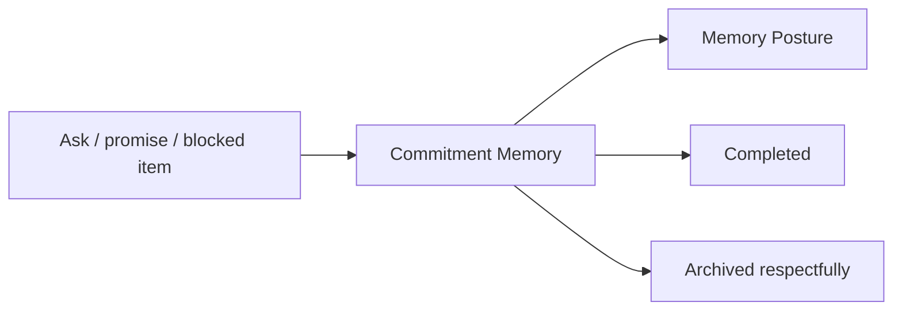

# Agent Self Notes And Commitments

Date: 05/10/2026

## Self Notes

Self notes are governed working aids for agents. They help Captains remember caution, lessons, open questions, follow-ups, working hypotheses, and verification needs.

Self notes are not canonical truth and are not publishable evidence. Sensitive notes default to tight visibility. Notes about people must be context/preference oriented, not judgment or scoring.

Valid example: "Next time amenity updates are mentioned, ask whether photos and website copy were updated."

Blocked example: "Manager is bad at follow-up."

## Commitments

Commitment Memory tracks open loops and obligations without blame:

- what was promised or requested
- owed by / owed to
- due date
- status
- related interaction, memory, or Expert Read

Commitments can be open, waiting, completed, blocked, expired, or archived. Overdue commitments should surface as operational reminders, not identity judgments.

