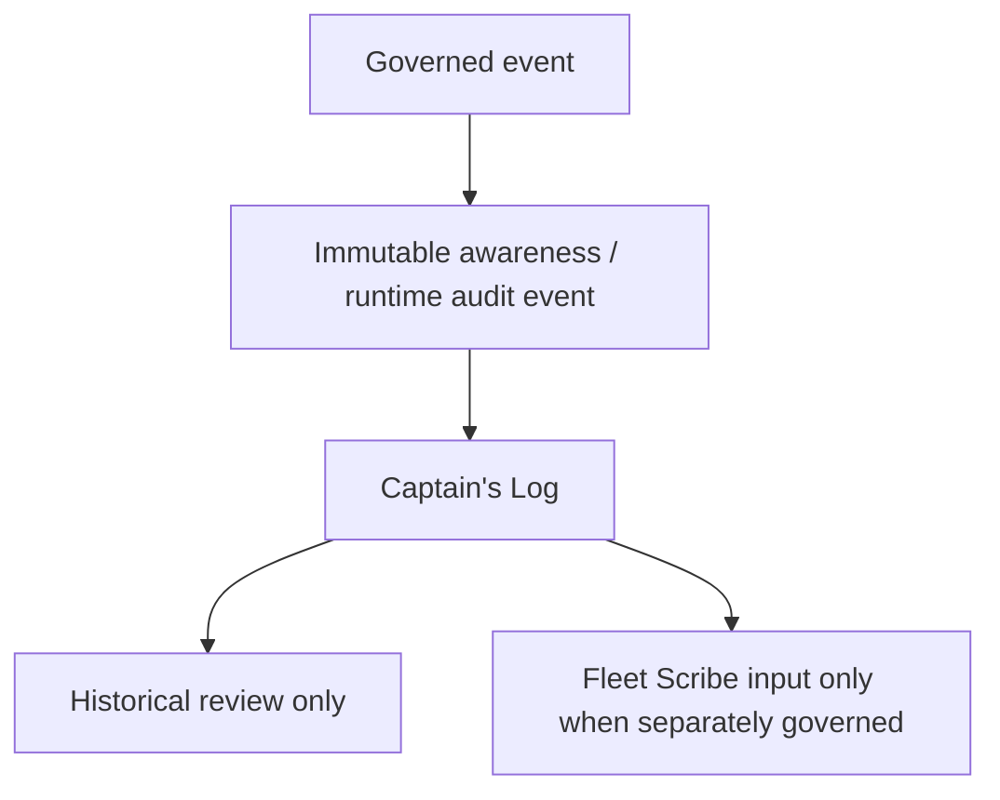

# Captain's Log Model

Date: 05/10/2026

## Purpose

Captain's Log is chronological continuity for Captain work. It is the archive and history layer for runtime lineage, reflection history, archived lessons, memory corrections, commitment status changes, superseded context, and notable governed events.

## What Belongs In The Log

- runtime history and lineage
- reflection run events
- memory archive trail
- superseded memory links
- correction submissions
- commitment status changes
- notable decisions and events with evidence lineage

## Boundary

Captain's Log is not a report publisher. It does not make memory canonical truth. It does not convert Self Notes into evidence. Fleet Scribe Office remains the official publication authority, and Quartermaster remains the blocking source-integrity control.

