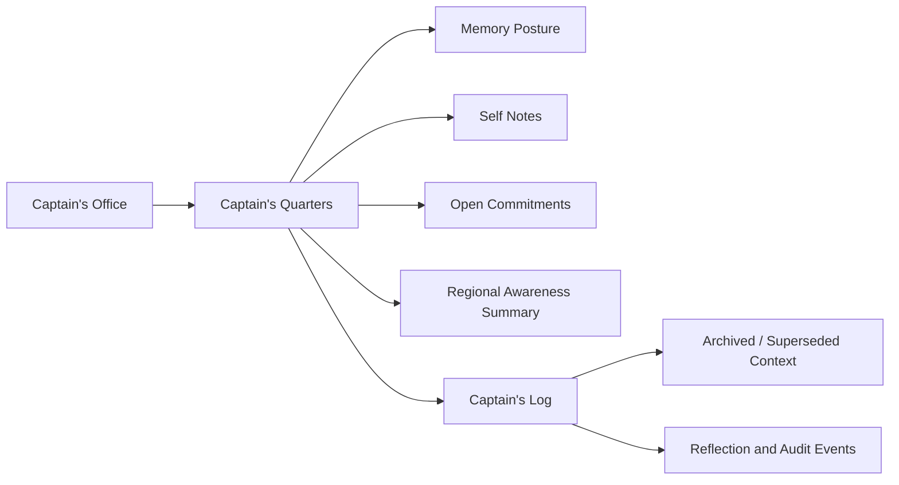

# Captain's Quarters Model

Date: 05/10/2026

## Purpose

Captain's Quarters is the Captain's working memory and stewardship space inside Captain's Office. It is where bounded property awareness stays visible without becoming canonical truth, publication authority, or autonomous behavior.

Captain's Quarters contains:

- Memory Posture
- Self Notes
- Open Commitments
- Verification Needed
- Open Questions
- Care Warnings
- Regional Awareness summaries
- Reflection Suggestions

## Boundary

Captain's Office is the human-facing operational workspace. Captain's Quarters is the working-memory/stewardship area inside it. Captain's Log is the chronological continuity and archive layer.

Captain's Quarters does not mutate Data Pond, promote memory to canonical fact, publish reports, approve public claims, bypass Quartermaster, bypass Fleet Scribe Office, or bypass Directive Control Center.

## Care Rules

Self Notes are not canonical truth or publishable evidence. Human-submitted memory remains claim-level until governed. Regional Awareness is summary-level only. Relationship memory may reduce friction, but must not become people scoring.

