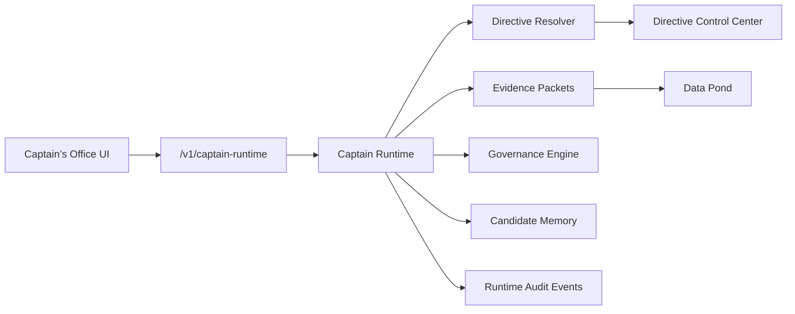
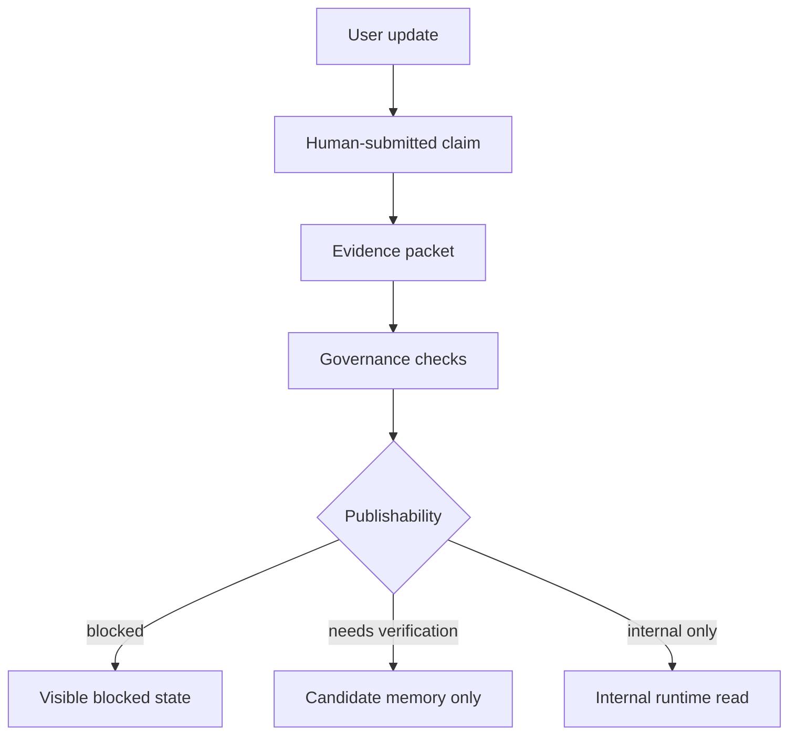

# Captain’s Office Architecture

Date: 05/09/2026

## Purpose

Captain’s Office is the governed operational workspace for property-specific Captain intelligence. It is not a consumer messaging surface, not an AI playground, and not a reporting system.

Captain’s Office sits on top of:

- Captain Runtime
- Directive Control Center
- Data Pond
- evidence packets
- runtime governance
- runtime lineage
- Watchlist systems
- memory candidate routing
- Fleet Scribe authority
- Quartermaster blocking controls

The runtime intelligence actor remains `Captain`. The governed interface is `Captain’s Office`. The orchestration layer remains `Captain Runtime`.

## Architecture Placement

Implementation lives in:

- `/Users/mark/Property_Analytics/apps/web/src/app/captains`
- `/Users/mark/Property_Analytics/apps/api/src/routes/captain-runtime.ts`
- `/Users/mark/Property_Analytics/apps/api/src/platform/captain-runtime/repository.ts`

The UI consumes Captain Runtime APIs. It does not recreate runtime logic, does not invoke GPT, does not mutate Data Pond, and does not promote memory.

## Routes

- `/captains`
- `/captains/[propertyId]`
- `/captains/[propertyId]/history`
- `/captains/[propertyId]/watchlist`
- `/captains/[propertyId]/memory-candidates`

Static property routes are generated from the governed property identity matrix, not from a one-off local property list.

## Runtime / UI Boundary

Boundary rules:

- UI submits interactions only through `/v1/captain-runtime/interactions`.
- UI reads office state, history, evidence, and memory candidates only through Captain Runtime read endpoints.
- UI does not expose raw internal payloads or system prompts.
- UI does not mutate evidence, directives, canonical facts, or runtime lineage.
- UI does not implement memory promotion workflows.

## Workspace Model

Captain’s Office displays:

- Captain Header
- Property Operational Summary
- Runtime Interaction Workspace
- Structured Captain Response
- Evidence / Authority Sidebar
- Routing / Actions Panel
- Watch Items / Alerts
- Candidate Memory Summary
- Runtime History / Lineage
- Runtime Lineage Footer

## Authority Classification Model

The UI preserves these distinctions:

- `canonical_fact`
- `verified_operational_fact`
- `human_submitted_claim`
- `advisory_observation`
- `stale_evidence`
- `unresolved_conflict`
- `blocked_evidence`

The UI must not flatten claims into facts. Manager-provided updates are visibly described as operational claims until governed verification occurs.

## Evidence Visibility Model

The Evidence / Authority sidebar shows:

- evidence freshness
- evidence classes
- source authority
- directive version/snapshot references
- runtime mode
- confidence state
- governance warnings
- stale evidence warnings
- unresolved conflict warnings
- evidence hash references

This reinforces that every response came from governed runtime evidence.

## Memory Candidate UX Rules

Candidate memory is displayed with:

- candidate type
- confidence
- verification requirement
- promotion state
- expiration state
- conflict state
- source evidence hash

The UI explicitly states that candidate memory is not canonical truth and that promotion is separate.

## Runtime History Model

Runtime history displays:

- prior interactions
- runtime mode
- authority level
- publishability
- confidence
- directive snapshot hash
- evidence hash
- response hash
- structured response summary

It does not expose giant runtime payloads, raw provider prompts, or internal system prompts.

## Authorization

Captain’s Office is an editor/admin operational surface.

API enforcement remains in Captain Runtime:

- unauthenticated users cannot access runtime reads or submissions;
- viewers cannot access Captain’s Office runtime routes;
- editors can use monitoring, lightweight, and standard runtime modes;
- escalated, executive, and simulation runtime modes require admin authorization.

## Operational Guardrails

- Fleet Scribe authority remains intact.
- Quartermaster source integrity remains blocking.
- Candidate memory cannot become canonical truth through the UI.
- Data Pond canonical truth cannot be mutated through the UI.
- No PIB/reporting coupling is introduced.
- No parallel reporting system is created.

## Deferred Items

- Dedicated runtime history filters.
- Property-scoped authorization beyond role-level access.
- Named approver-group capabilities for escalated/executive/simulation modes.
- Memory promotion workflow, deliberately outside this implementation.
- Bench/Fleet overlays, deliberately held for future layers.
