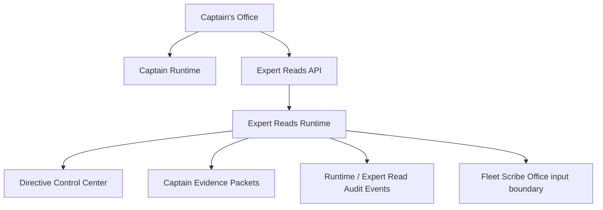

# Captain’s Office Expert Reads Integration

Date: 05/10/2026

## Purpose

Captain’s Office now exposes Expert Reads as governed specialist contributions from the Consulting Bench. This is a visibility and request surface over existing Captain Runtime, Directive Control Center, evidence packet, and Expert Reads APIs.

It is not a new runtime, report authoring system, autonomous expert-agent interface, or Fleet Scribe publication workflow.

## Placement

The UI lives in:

- `/Users/mark/Property_Analytics/apps/web/src/app/captains/captain-office-client.tsx`
- `/Users/mark/Property_Analytics/apps/web/src/app/captains/[propertyId]/expert-reads/page.tsx`

The route is:

- `/captains/[propertyId]/expert-reads`

The route is statically generated from the governed property identity route list. A separate `/captains/[propertyId]/expert-reads/[expertReadId]` page was intentionally not added because the web app uses static export and Expert Read ids are runtime-created records. Detail rendering is provided inside the Expert Reads route by selected Expert Read id.

## UX Model

The Expert Reads surface shows:

- Consulting Bench lane
- runtime mode
- read status
- confidence
- freshness
- publishability
- escalation state
- generated date
- source runtime lineage
- evidence packet hash
- directive snapshot hash
- Expert Read hash
- request hash
- findings
- recommendations
- do-not-do guidance
- conflicts and caveats

The interface states that Expert Reads are specialist contributions and not final reports. It also keeps Fleet Scribe Office publication authority and Quartermaster blocking controls visible.

## Governance Visibility Rules

The UI visibly distinguishes:

- blocked reads
- stale or conflicting evidence
- nonpublishable recommendations
- verification-required findings
- unsupported/blocked recommendations
- Quartermaster-relevant states
- escalation-required reads

Blocked, stale, conflicting, or Quartermaster-relevant reads display a governance warning before the detailed findings and recommendations.

## Expert Read Request Workflow

Users with Captain’s Office access can request a lane-specific Expert Read from the property route.

Request controls:

- lane selector
- governed request reason
- runtime mode inherited from the Captain’s Office runtime mode selector
- latest Captain evidence packet id/hash
- latest Captain Runtime session and interaction lineage when available

Requests are submitted only to:

- `/v1/expert-reads`

The UI does not run lanes directly, invoke GPT, mutate Data Pond, or promote memory.

## Runtime / UI Boundary

Captain’s Office consumes:

- `/v1/captain-runtime/properties/:propertyId/office`
- `/v1/expert-reads/properties/:propertyId`
- `/v1/expert-reads/:expertReadId`
- `/v1/expert-reads`

The UI does not expose raw prompts, giant runtime payloads, hidden system instructions, or internal prompt text.

## Authority Boundaries

- Expert Reads remain governed specialist contributions.
- Expert Reads are not final reports.
- Fleet Scribe Office remains publication authority.
- Quartermaster remains blocking.
- Directive Resolver governs lane behavior.
- Evidence packets govern reasoning scope.
- Candidate memory remains noncanonical.
- Data Pond remains authoritative for facts.

## Deferred

Property-specific authorization still follows the existing role-gated Captain’s Office and Expert Reads API controls plus property/evidence lineage checks. A finer-grained per-property permission primitive should be added when the platform defines one canonical authorization model for property-scoped Expert Reads.
