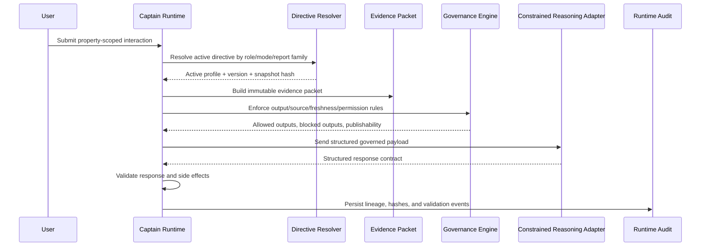
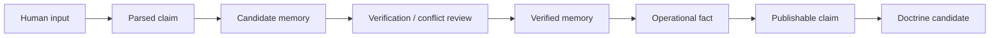

# Captain Runtime Orchestration Architecture

Date: 05/09/2026

## Purpose

The Captain Runtime Orchestration Layer is the governed runtime foundation between users, Captains, Data Pond, directives, memory, evidence, Bench lanes, Fleet Scribe, and GPT reasoning.

This is not a chatbot feature and not a reporting system. It is the runtime nervous system that receives interactions, resolves authority, assembles scoped evidence, applies directives, builds constrained reasoning payloads, validates structured outputs, and preserves lineage.

## Placement

Implementation lives in:

- `apps/api/src/platform/captain-runtime`
- `apps/api/src/routes/captain-runtime.ts`
- `apps/api/migrations/0048_create_captain_runtime_orchestration.sql`
- `infra/migrations/0035_create_captain_runtime_orchestration.sql`

This placement keeps runtime orchestration beside the existing Captain platform code while separating it from:

- locked PIB generation
- Watchlist report rendering
- Spotlight report rendering
- Fleet Scribe official artifact generation
- low-level Data Collection ingestion

## Existing Systems It Uses

- Directive Control Center: every runtime interaction resolves active policy through `resolveRuntimeDirective`.
- Data Pond / D1 facts: property identity and available operating context come from governed tables.
- Captain runtime tables: watch items, actions, and brief runs provide recent operating context.
- Governed memory tables: memory entries are read as scoped evidence; new human input is not promoted directly.
- Fleet Scribe and Bench directives: role routing and publishability boundaries remain policy-driven.

## Runtime Flow

1. Receive user interaction through `/v1/captain-runtime/interactions`.
2. Resolve property context from `communities`.
3. Classify intent deterministically.
4. Resolve the applicable directive for that intent and runtime mode.
5. Create a runtime session and interaction row.
6. Assemble scoped property context.
7. Generate a governed evidence packet.
8. Enforce directive-scoped governance.
9. Build a structured GPT runtime payload.
10. Execute constrained reasoning through the runtime adapter.
11. Validate structured response shape.
12. Store response, memory candidates, routing decisions, and audit events.

## Runtime Domain Model

Implemented entities:

- `CaptainRuntimeSession`
- `CaptainInteraction`
- `CaptainEvidencePacket`
- `CaptainReasoningRequest`
- `CaptainReasoningResponse`
- `CaptainMemoryCandidate`
- `CaptainRoutingDecision`
- `CaptainAuditEvent`

## Evidence Packet System

Evidence packets are structured and immutable after generation.

Evidence classes:

- canonical fact
- verified operational fact
- human-submitted claim
- advisory observation
- inferred signal
- unresolved conflict
- stale evidence
- blocked evidence

The first implementation includes:

- canonical property context from `communities`
- active Captain watch items where present
- active Captain actions where present
- recent governed memory where present
- the current user input as a human-submitted claim

Evidence packets include source list, freshness state, directive snapshot id, and hash.

The packet hash intentionally excludes volatile row identifiers and generation timestamps. This makes packet evidence replayable and reproducible when the same governed evidence and claim are assembled again.

## Governance Model

The runtime enforces:

- GPT is not the source of truth.
- Human input is claim-level until verified.
- Canonical facts come from governed tables.
- Draft directives cannot affect runtime outside simulation.
- Stale/conflicting evidence is labeled and may block depending on directive policy.
- Fleet Scribe publication boundaries remain intact.
- Quartermaster source integrity remains blocking.
- GPT cannot mutate canonical facts or write directly to DB truth tables.

## GPT Runtime Payload Contract

Payloads are structured and dynamically assembled. They include:

- role identity
- runtime authority
- active directive snapshot
- property context
- evidence packet
- relevant memory
- governance constraints
- output contract

The runtime does not store a giant static prompt blob as the policy source. The payload is a scoped runtime object backed by directive and evidence lineage.

## Structured Response Contract

Accepted responses must include:

- conversational response
- reasoning summary
- memory candidates
- routing decisions
- escalation needs
- confidence assessment
- publishability assessment
- required follow-ups
- unresolved conflicts

Invalid responses fail safely and are not allowed to create memory candidates or routing side effects.

Malformed or prose-only reasoning cannot mutate state. The runtime rejects missing fields, extra hallucinated fields, invalid enum values, invalid confidence values, oversized responses, invalid memory candidates, and invalid routing decisions before persistence.

## Memory Promotion Lifecycle

Human input follows this lifecycle:

raw input -> parsed claim -> candidate memory -> verified memory -> operational fact -> publishable claim -> doctrine candidate

The first implementation creates `CaptainMemoryCandidate` rows only. It does not promote directly into governed memory entries.

Candidate memory records include evidence hash lineage, expiration, conflict state, and duplicate detection support. They cannot become canonical truth without a separate governed promotion process.

## Runtime Modes

Supported modes:

- monitoring
- lightweight
- standard
- escalated
- executive
- simulation

Modes are passed into the Directive Resolver and stored with runtime sessions and reasoning requests. Future extensions can vary evidence breadth, Bench participation, and strictness by mode without changing the persistence model.

API access currently allows editors to use monitoring, lightweight, and standard modes. Escalated, executive, and simulation modes require admin authorization until named approver-group permissions are introduced.

## Auditability Guarantees

The runtime records:

- interaction received
- directive snapshot id/hash
- evidence packet hash
- GPT payload generation
- reasoning response acceptance
- response hash
- memory candidate creation
- routing decisions

Runtime evidence packets and audit events are immutable through database triggers.

Hardening now also protects runtime sessions, interactions, reasoning requests, and reasoning responses from update/delete mutation. Runtime idempotency keys can prevent duplicate session creation for retried submissions.

## Failure Mode Behavior

- Directive resolution failure stops the interaction before evidence or reasoning is created.
- Evidence validation failure writes an audit event and stops before reasoning.
- Payload validation failure writes an audit event and stops before reasoning.
- Response validation failure writes an audit event and stops before memory or routing side effects.
- Side-effect validation failure writes an audit event and stops before memory or routing persistence.
- Duplicate idempotency keys fail at persistence and prevent replayed submissions from creating duplicate runtime sessions.

## Deferred Items

- Real provider adapter for external GPT calls. Current implementation uses a constrained deterministic reasoning adapter so the governance and lineage shell can be tested without letting a model mutate state.
- Broader Data Pond fact pack assembly across all operational source families.
- Named approver-group permissions for escalated/executive/simulation runtime modes.
- UI surface for Captain interaction history.

## Boundary Confirmation

The runtime is additive to Data Pond, Captain runtime, Watchlist, Spotlight, PIB, Fleet Scribe, and approved artifact generation systems. It does not create a parallel report family or mutate locked PIB files.
