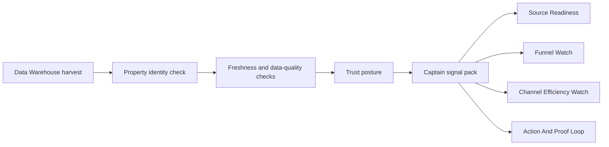

# Captain Signal Flow

Status: Active advisory flow
Date: 2026-05-26
Owner: Data Collection / Data Pond / Captain Runtime
Manifest: `/Users/mark/Property_Analytics/config/captain_signal_flow_manifest.json`

## Purpose

Get new empirical data in front of Property Captains quickly without breaking data integrity.

The flow separates facts from interpretation:

1. source data is harvested
2. validation and identity checks run
3. trust posture is assigned
4. Captain signal packs are generated
5. Captains see advisory or trusted signals with lineage
6. Captain memory and actions can interpret those signals without mutating source facts

## Current Active Lane

`dw_leasing_funnel_shadow`

- Harvest script: `/Users/mark/Property_Analytics/scripts/run_data_warehouse_daily_harvest.mjs`
- Captain advisory generator: `/Users/mark/Property_Analytics/scripts/generate_data_warehouse_captain_advisory.mjs`
- Source packet root: `/Users/mark/Property_Analytics/outputs/data_warehouse/daily_harvest/`
- Captain packet root: `/Users/mark/Property_Analytics/outputs/captain_signal_flow/data_warehouse/`
- Routine bindings:
  - `source_readiness`
  - `funnel_watch`
  - `channel_efficiency_watch`
  - `action_proof_loop`

Current posture is advisory because the Data Warehouse lane still needs reconciliation against historical daily exports before it can become canonical.

## First Captain Advisory Packet

Packet:

```text
/Users/mark/Property_Analytics/outputs/captain_signal_flow/data_warehouse/2026-05-26_20260526_154651
```

Source harvest:

```text
/Users/mark/Property_Analytics/outputs/data_warehouse/daily_harvest/2026-05-26_20260526_152346
```

Window: `2026-05-25` to `2026-05-26`

Portfolio summary:

- guest cards: 363
- portal quotes: 185
- online apps: 89
- pipeline apps: 3
- scheduled tour appointments: 103
- business watch items: 18
- properties with watch items: 13
- data-quality items: 1
- identity unresolved rows: 0

Trust posture:

- `degraded_advisory`

Reason:

- The data is fresh and property identity resolved.
- The lane remains advisory until export reconciliation is complete.
- One data-quality item exists: future-dated `dbo.dw_prospect_log_entry.created_dtt`.
- The 10-file guest-card export reconciliation did not pass trusted promotion; see `/Users/mark/Property_Analytics/docs/DATA_WAREHOUSE_GUEST_CARD_RECONCILIATION_2026-05-26.md`.

## Captain Packet Outputs

Each packet contains:

- `captain_advisory.md`: human-readable Captain advisory
- `captain_signal_pack.json`: machine-readable portfolio and property signals
- `property_signal_pack.csv`: property-scoped signal rows for review, filtering, and downstream ingest

## How Captains Should Use This

Captains may:

- notice current funnel movement
- identify properties with guest cards but no quotes, applications, or scheduled tours
- compare day-over-day funnel pressure
- prepare evidence-linked action candidates
- ask for source-owner review where data quality is degraded

Captains may not:

- treat advisory packets as canonical source-of-truth metrics
- fabricate missing reasons for low conversion
- merge resident, service, pricing, or funnel signals without their source contracts
- write raw advisory facts into canonical tables as trusted facts

## Emerging New Data Lanes

The same flow should be used for:

- `dw_resident_voice_candidate`
- `dw_inventory_pricing_candidate`
- `dw_service_operations_candidate`

Each lane needs its own source contract, sensitive-field boundary, validation checks, and promotion gate before trusted Captain use.

## Daily Operating Flow

Codex local automation `data-warehouse-daily-shadow-harvest` now runs the daily Data Warehouse harvest and then generates this Captain advisory packet. The automation remains local and depends on VPN and Keeper/KSM availability.



## Promotion Gates

A new lane can move from advisory to trusted only when:

- source contract is documented
- property identity resolves
- validation checks pass
- freshness policy is defined
- sensitive-field policy is satisfied
- historical or source-of-record reconciliation passes
- Watchtower exposes current source health
- Captain routines cite packet lineage and trust posture
