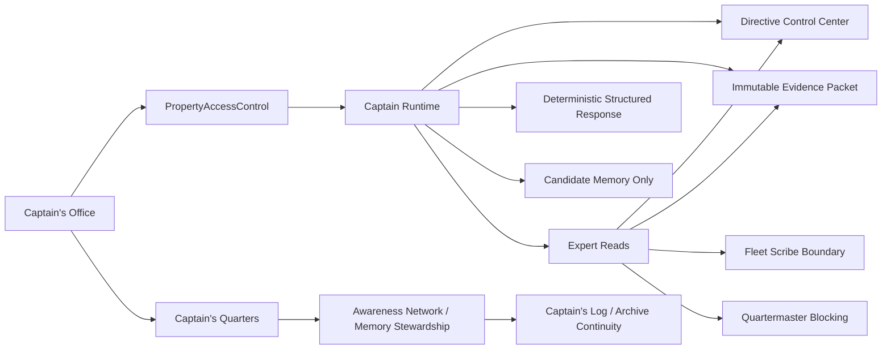
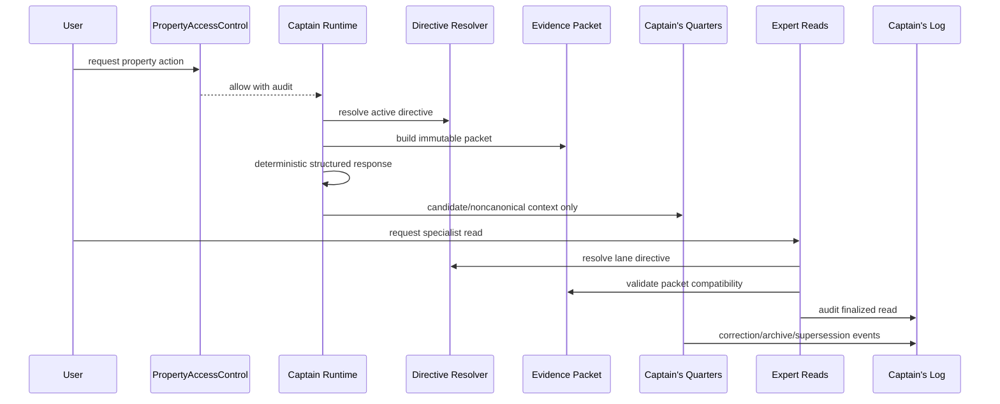

# Cross-System Runtime Acceptance Audit

Date: 05/10/2026

## Readiness Decision

`ready_for_model_gateway: true`

This decision means the governed runtime foundation is ready for a future Model Provider Gateway design pass. It does not approve real GPT integration in the current system.

## Architecture Map

## Subsystem Acceptance

| System | Entry Points | Boundary Verified |
| --- | --- | --- |
| Data Pond | community/property/evidence substrate | Runtime and memory read facts; Awareness and Expert Reads do not mutate canonical truth. |
| PropertyAccessControl | `requirePropertyAccess`, `/v1/*` route gates | Access is checked before Captain Runtime, Awareness posture, self notes, commitments, regional summaries, Expert Reads, history, evidence, and memory candidates. |
| Directive Control Center | `resolveRuntimeDirective`, Expert lane resolver | Active approved directives produce runtime snapshot ids/hashes; draft and inactive directive behavior is covered by directive tests. |
| Captain Runtime | `/v1/captain-runtime/*` | Creates sessions, interactions, evidence packets, reasoning requests/responses, candidate memory, routing, and audit events without real GPT. |
| Captain's Office | `/captains`, `/captains/[propertyId]` | Consumes runtime APIs only and displays authority, confidence, publishability, evidence, and lineage labels. |
| Captain's Quarters | `/captains/[propertyId]/quarters`, `/v1/awareness/*` | Exposes Memory Posture, Self Notes, Open Commitments, Care Warnings, and Regional Awareness as noncanonical working memory. |
| Captain's Log | runtime history plus Awareness archive/correction/supersession events | Preserves continuity and lineage without treating archived/superseded context as active truth. |
| Awareness Network | `/v1/awareness/*`, `apps/api/src/platform/awareness` | Care metadata, noncanonical memory, correction/archive paths, and reflection suggestions are enforced. |
| Expert Reads | `/v1/expert-reads/*` | Specialist contributions only; cannot self-authorize publication or mutate memory/Data Pond. |
| Fleet Scribe Office | docs/directive boundaries | Publication authority remains outside Captain Runtime, Awareness, and Expert Reads. |
| Quartermaster | directive/expert lane boundary | Unsupported, stale, conflicting, or unverified source claims remain blocked or nonpublishable. |

## End-To-End Flow Verification

Flow A, authorized Captain interaction:

- PropertyAccessControl allows `interact_captain`.
- Captain Runtime resolves active Directive Control Center snapshot.
- Evidence packet is generated and hashed.
- Deterministic constrained reasoning returns structured output.
- Side effects are candidate memory and routing only.
- Audit events preserve correlation id, evidence hash, directive hash, and response hash.

Flow B, unauthorized property access:

- PropertyAccessControl denies before runtime/evidence tables receive data.
- Denial is audited.
- No runtime session or evidence packet is created.

Flow C/D/E/F, Captain's Quarters:

- Memory Posture is access-gated.
- Self Notes are noncanonical and private by default.
- Invalid people-scoring/blame Self Notes are rejected and audited.
- Commitments are neutral open loops and status changes are auditable.

Flow G, Regional Awareness:

- Regional summary access is gated by PropertyAccessControl.
- Summaries are stored and returned at pattern level.
- Private relationship context and raw Self Notes are not exposed through the tested summary surface.

Flow H/I, Expert Reads:

- Expert Read requests are access-gated by property, runtime mode, and lane.
- Expert Lane Resolver calls Directive Resolver.
- Evidence packet compatibility is checked.
- Expert Reads are stored as specialist contributions with evidence/directive lineage and nonpublishable constraints.

Flow J, Captain's Log continuity:

- Correction, supersession, expiration/archive events preserve before/after lineage.
- Active posture excludes archived/superseded memory.
- Historical context remains available as archive/log continuity only.

## Bypass Path Audit

No accepted path was found that lets:

- Captain's Office call GPT directly
- UI bypass Captain Runtime for runtime decisions
- Runtime bypass Directive Resolver
- Expert Reads bypass Directive Resolver
- Awareness routes bypass PropertyAccessControl
- memory mutate Data Pond
- Self Notes become evidence
- reflection routines promote memory
- candidate memory become canonical truth
- Expert Reads become reports
- Fleet Scribe publication authority be bypassed
- frontend checks act as the only security boundary

## Authorization Acceptance

The acceptance tests and existing PropertyAccessControl suite cover:

- missing/malformed actor fail-closed
- unauthorized property fail-closed
- unauthorized runtime mode fail-closed
- unauthorized Expert Read lane fail-closed
- revoked/expired grants ignored
- explicit deny precedence
- property, region, and portfolio grant precedence
- denial audit events
- Expert Read detail masking where record inference matters

## Directive / Governance Acceptance

Runtime participants preserve directive snapshot ids/hashes. Captain Runtime uses active role directives based on classified intent. Expert Reads use lane directives through the Expert Lane Resolver. Draft directives remain simulation-only. Runtime and Expert Read outputs carry blocked outputs, publication boundaries, freshness/confidence posture, and Fleet Scribe / Quartermaster constraints.

## Evidence Acceptance

Captain evidence packets are immutable, hashed, scoped to property, and replayable. Expert Reads validate property match, evidence hash, directive snapshot linkage, and lane compatibility before generation. Evidence and payload details exposed through UI/API are summarized and do not expose raw giant payload blobs.

## Awareness / Memory Acceptance

Awareness memory remains noncanonical. Self Notes are not truth or publishable evidence. Human input remains claim-level until governed. Care metadata affects allowed use decisions. Relationship context is blocked from scoring/publication/upward raw summary uses. Reflection routines create suggestions only. Doctrine candidates are not approved doctrine.

## UI / UX Governance Acceptance

Captain's Office remains the workspace label. Captain's Quarters labels the working memory/stewardship surface. Captain's Log labels runtime history/lineage. UI copy states that Self Notes are not canonical truth, Expert Reads are not final reports, Fleet Scribe Office remains publication authority, and Quartermaster source controls remain blocking.

## Audit Lineage Reconstruction

The tested chain reconstructs:

- actor
- property id
- PropertyAccessControl allow/deny decision
- session id
- interaction id
- directive snapshot id/hash
- evidence packet id/hash
- response hash
- Expert Read id/read hash
- self note id
- commitment id
- memory correction/supersession/archive events
- before/after state where applicable
- correlation id
- timestamp and reason fields

## Risk Matrix

| Severity | Risk | Status |
| --- | --- | --- |
| Critical | Real GPT integration before gateway controls. | Not implemented. |
| Critical | Memory mutates Data Pond or canonical truth. | Blocked by architecture/tests. |
| High | Authorization bypass across runtime/memory/expert routes. | Route-level PropertyAccessControl tested. |
| High | Expert Reads self-authorize reports/publication. | Blocked by validation/schema/UI labels. |
| High | Self Notes become evidence. | Blocked by governance and UI labels. |
| Medium | Regional summary partial-access filtering for complex mixed grants. | Deferred; current surface is summary-level and region-gated. |
| Medium | Full Captain's Log browser. | Deferred; current lineage exists in runtime history and Awareness audit/archive records. |
| Low | UI copy drift. | Current Captain's Office / Quarters / Log labels tested by source-level acceptance. |

## Known Deferred Items

- Model Provider Gateway design and provider integration
- real GPT calls
- autonomous agent behavior
- memory promotion workflow
- doctrine approval workflow
- Fleet Scribe publishing workflow
- full Captain's Log archive browser
- regional partial-access summarizer beyond current summary-level, region-gated storage

## Known Unrelated Failures

An earlier full platform run surfaced two unrelated existing failures:

- Captain Brief source-display alias expectation: `Apartments.com` vs `Apartments.com / ADC`
- Watchtower/health BI source alias expectation: `bi_manual` vs current canonical `bi_report`

They were not modified in this acceptance pass.

## Required Before Real GPT

- Design and review the Model Provider Gateway as a separate constrained layer.
- Bind provider calls to directive snapshot, evidence packet hash, response schema, blocked outputs, payload hash, and audit event requirements.
- Add provider egress logging and replay protection.
- Keep deterministic adapter tests as fallback and contract reference.

## Recommended Next Prompt Scope

Design only: Model Provider Gateway contract, provider egress policy, redaction boundary, response validation, audit lineage, replay controls, and kill-switch behavior. Do not connect a real provider until that design is accepted.
