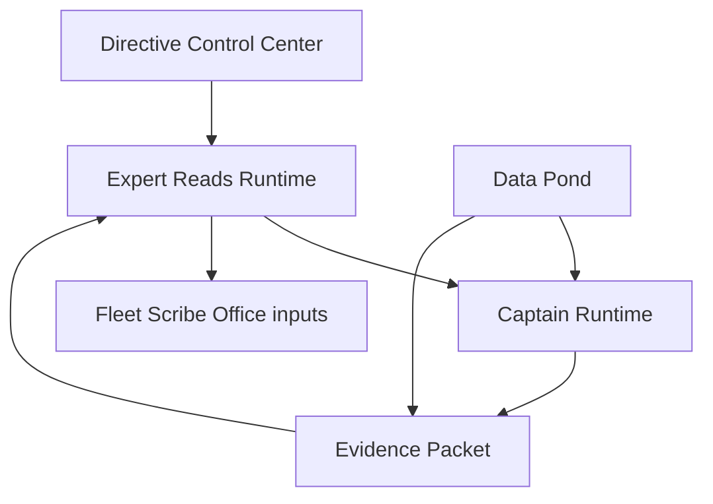
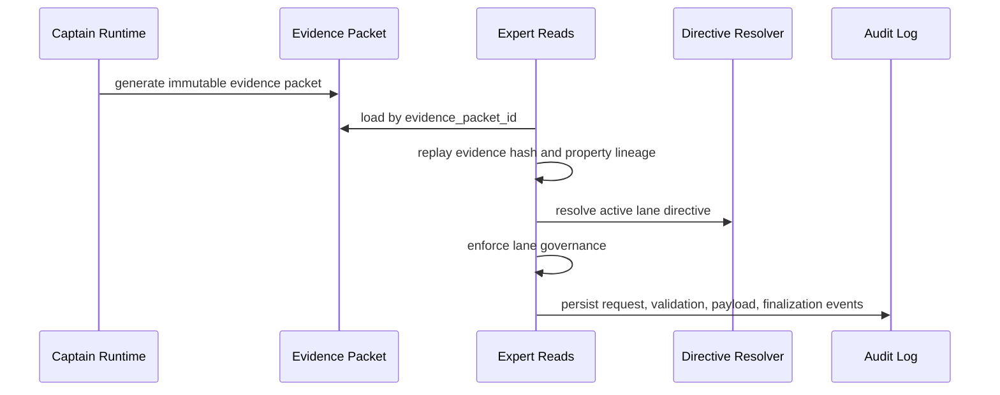

# Expert Reads Runtime Architecture

## Purpose

Expert Reads are governed specialist contributions from the Consulting Bench. They sharpen narrow decision areas for Captain Runtime, future Fleet workflows, and Fleet Scribe publication workflows.

They are not autonomous agents, independent assistants, report authors, chatbot lanes, or report generators.

## Placement

Expert Reads live at:

- `/Users/mark/Property_Analytics/apps/api/src/platform/expert-reads`
- `/Users/mark/Property_Analytics/apps/api/src/routes/expert-reads.ts`

The layer is additive to Captain Runtime. It does not create a parallel runtime or reporting path.

## Runtime Flow

1. Receive a governed Expert Read request.
2. Resolve the property through Captain Runtime/Data Pond identity.
3. Load a Captain evidence packet by id.
4. Resolve the active lane directive through the Directive Resolver.
5. Apply lane-specific governance.
6. Build a structured Expert Read payload.
7. Use deterministic constrained reasoning for now.
8. Validate the structured Expert Read.
9. Persist the request, read, findings, recommendations, and audit events.
10. Return structured lineage metadata.

## Authority Rules

- Directive Resolver governs lane behavior.
- Evidence packets govern reasoning scope.
- Human-submitted input remains claim-class evidence.
- Expert Reads cannot mutate Data Pond facts.
- Expert Reads cannot promote memory.
- Expert Reads cannot publish artifacts.
- Fleet Scribe Office remains publication authority.
- Quartermaster remains blocking for source-integrity failures.

## Evidence And Directive Lineage

Every Expert Read request stores:

- `directive_snapshot_id`
- `directive_snapshot_hash`
- `evidence_packet_id`
- `evidence_packet_hash`
- `request_hash`
- `source_runtime_id`, when invoked from Captain Runtime
- `source_interaction_id`, when invoked from a specific interaction

This preserves replayability and makes each specialist contribution traceable to the runtime state that produced it.

The runtime also replays the Captain evidence packet hash before generation. Property mismatch, missing canonical property evidence, missing packet hash, or replay-hash mismatch blocks the Expert Read before any final read is persisted. Lane-specific evidence gaps are surfaced as governance warnings and must produce blocked or nonpublishable specialist output unless evidence is later provided.

## Lane Contracts

Each Consulting Bench lane has a structured contract:

- required output sections
- required evidence sources
- blocked recommendation patterns
- default do-not-do rules
- adjustment point

Explicit lane shapes currently exist for:

- Quartermaster
- Navigator
- Revenue Advisor
- Signals Officer
- Product Readiness Officer
- Trust And Proof Advisor

All other Consulting Bench lanes are seeded with default structured contracts and lane-specific adjustment points.

## Consulting Bench Runtime Model

The Consulting Bench is a collection of expert lanes. A lane is invoked by orchestration when a specific decision needs specialist treatment. Lanes do not initiate independent work, maintain independent truth, or generate final reports.

Invocation sources:

- Captain Runtime
- future Fleet workflows
- future Fleet Scribe workflows
- simulation/test harnesses

Routing posture:

- `no_expert_needed`
- `optional_expert_read`
- `required_expert_read`
- `blocked_pending_expert_read`

Expert Reads are not mandatory for every interaction.

## Expert Read Output Contract

Every accepted Expert Read must include:

- specialist summary
- adjustment point
- evidence used
- findings
- recommendations
- proof metrics
- do-not-do rules
- confidence
- freshness
- conflicts
- escalation recommendation
- publishability assessment

Prose-only Expert Reads fail validation. Malformed reads are not persisted as final.

## Lane-Specific Governance Rules

Lane-specific controls include:

- Quartermaster: can block source confidence, freshness, or conflict failures.
- Navigator: cannot recommend public copy from unverified local claims.
- Revenue Advisor: cannot recommend pricing, concession, or spend posture without exposure/value evidence.
- Signals Officer: cannot defend or scale spend without downstream output evidence.
- Product Readiness Officer: cannot make readiness claims without unit/feed/readiness evidence.
- Trust And Proof Advisor: cannot approve unsupported USPs or claims.

All lanes inherit common blocks against Data Pond mutation, memory promotion, artifact publication, external messaging, and unsupported publishable claims.

## Captain Runtime / Expert Read Integration

Captain Runtime owns intake, property context, memory candidate routing, runtime lineage, and evidence packet generation. Expert Reads consume Captain evidence packets by id and return specialist contributions by id.

Captain Runtime can reference Expert Read ids in future routing/action lineage without making every runtime interaction require bench participation.

## Evidence And Directive Lineage For Expert Reads

The evidence packet is immutable after generation. The directive runtime snapshot is preserved from the active Directive Resolver output. Expert Reads store both hashes, so the exact evidence/directive state can be reconstructed.

Evidence classes remain distinct:

- canonical fact
- verified operational fact
- human-submitted claim
- advisory observation
- inferred signal
- unresolved conflict
- stale evidence
- blocked evidence

## Fleet Scribe Boundary

Expert Reads are inputs to the chain, not final artifacts. Fleet Scribe decides final format, wording, audience, publication, and archive handling.

Draft, incomplete, blocked, or `needs_verification` Expert Reads cannot be treated as publishable Fleet Scribe input. Expert Reads cannot self-authorize `publishable` states at the validator or database-constraint layer. Nonpublishable claims remain nonpublishable until proof and approval clear through the proper authority path.

## Replay And Failure Safety

- Duplicate Expert Read requests are blocked by a deterministic `request_hash`.
- Finalized reads, findings, recommendations, requests, and audit events are immutable and protected from deletion.
- Audit events preserve correlation id, evidence hash, directive hash, and read hash where applicable.
- Malformed structured output fails validation before persistence as a final Expert Read.
- Failed compatibility, payload validation, output validation, duplicate replay, and finalization events are logged.

## API Surface

- `POST /v1/expert-reads`
- `GET /v1/expert-reads/:expertReadId`
- `GET /v1/expert-reads/properties/:propertyId`
- `GET /v1/expert-reads/properties/:propertyId/:laneId`

The API exposes structured lineage metadata and redacted evidence summaries. It does not expose raw prompts or giant internal payloads.

## Non-Negotiable Boundaries

- No parallel reporting system.
- No PIB coupling.
- No autonomous expert agents.
- No direct GPT provider integration yet.
- No direct Data Pond mutation.
- No memory promotion.
- No Fleet Scribe bypass.
- No Quartermaster bypass.
