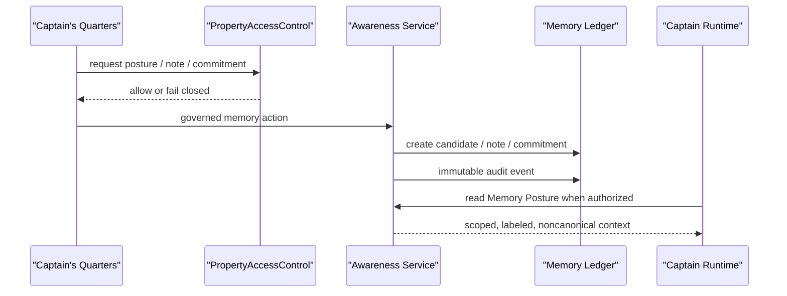

# Memory Stewardship Architecture

Date: 05/10/2026

## Placement

The Awareness Network lives in `apps/api/src/platform/awareness` with governed API routes at `apps/api/src/routes/awareness.ts`. It uses additive migrations:

- `apps/api/migrations/0051_create_awareness_network.sql`
- `infra/migrations/0038_create_awareness_network.sql`

Captain's Office consumes awareness through `/v1/awareness/*` APIs. Captain's Quarters is the user-facing working memory/stewardship area inside Captain's Office. The UI does not mutate canonical truth, promote memory, publish reports, or bypass runtime governance.

## Integration

- PropertyAccessControl gates every property, region, and fleet memory access.
- Directive Control Center remains the behavior and policy layer.
- Captain Runtime remains orchestration and evidence packet authority.
- Expert Reads remain specialist contributions, not memory promotion.
- Quartermaster remains the blocking source-integrity control.
- Fleet Scribe remains publication authority.
- Data Pond remains the evidence/truth substrate.

## Runtime Flow

## Safety Model

Memory Stewardship is a ledger and posture system. It preserves what entered the system, labels its authority, keeps open loops visible, and provides correction/archive paths. It does not create canonical property truth. Captain's Log is the chronological continuity/archive layer for runtime history, reflection events, correction trail, archived memory, superseded memory, and notable governed events.

Reflection routines are deterministic and produce suggestions only.
