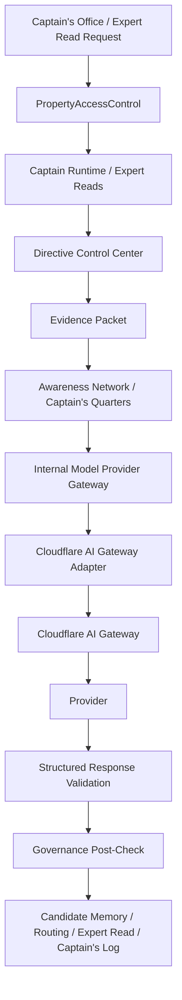

# Model Provider Gateway Architecture — 2026-05-10

## Purpose

The **Model Provider Gateway** is the internal application authority boundary for any future model-provider traffic. It sits below Captain Runtime, Expert Reads, and future governed model-consuming workflows. It treats model providers as replaceable inference services and keeps all truth, access, publication, and memory authority inside the platform.

Cloudflare AI Gateway is the first **Model Provider Adapter** infrastructure target. It is an enhancer for routing, limits, observability, fallback, and provider abstraction. It is **not** the intelligence architecture and it is **not** the authority layer.

## Placement

Canonical implementation location:

- `/Users/mark/Property_Analytics/apps/api/src/platform/model-gateway`

Primary modules:

- `types.ts`
- `config.ts`
- `redaction.ts`
- `validation.ts`
- `audit.ts`
- `gateway.ts`
- `adapters/deterministic.ts`
- `adapters/noop.ts`
- `adapters/cloudflare-ai-gateway.ts`
- `adapters/shadow-mode.ts`

## Stack Position

## Integration Notes

### Captain Runtime

- Captain Runtime now calls the gateway abstraction instead of directly owning the deterministic reasoning call.
- Default accepted behavior remains deterministic.
- Gateway returns structured runtime output only.
- Captain Runtime still decides whether validated response side effects can be persisted.
- No model output writes directly to Data Pond or Captain memory tables.

### Expert Reads

- Expert Reads now call the gateway abstraction instead of directly owning the deterministic generator call.
- Default accepted behavior remains deterministic.
- Expert Read validation remains mandatory.
- Fleet Scribe remains publication authority.
- Quartermaster remains blocking.

### Directive Control Center

- Directive snapshot id and directive snapshot hash are required gateway inputs.
- Missing directive lineage fails closed.
- Cloudflare or any model provider does not decide runtime rules.

### Evidence Packets

- Evidence packet id and evidence packet hash are required gateway inputs where governed runtime flow requires them.
- Evidence packet remains authoritative for reasoning scope.
- Provider payloads receive minimized evidence summaries, not raw dumps.

### Awareness Network / Captain's Quarters

- Awareness remains care-governed and noncanonical.
- Provider payloads receive minimized, filtered awareness summaries only.
- Self notes are not treated as evidence.
- Unauthorized or disallowed awareness context is filtered out before provider transit.

### PropertyAccessControl

- PropertyAccessControl remains the access authority.
- Gateway assumes access was already resolved upstream.
- Gateway does not create alternate access paths.

### Fleet Scribe Boundary

- Gateway cannot publish reports.
- Gateway cannot self-authorize publication.
- Gateway output may become a specialist contribution or runtime candidate only after validation and post-check.

## Authority Rules

- Cloudflare is an infrastructure enhancer, not the authority layer.
- Internal Model Provider Gateway owns application-side governance and acceptance.
- Deterministic adapter remains the default accepted-output path.
- Live provider calls remain disabled by default.
- Model output cannot mutate Data Pond.
- Model output cannot promote memory.
- Model output cannot publish reports.
- Quartermaster remains blocking.
- Fleet Scribe remains publication authority.
