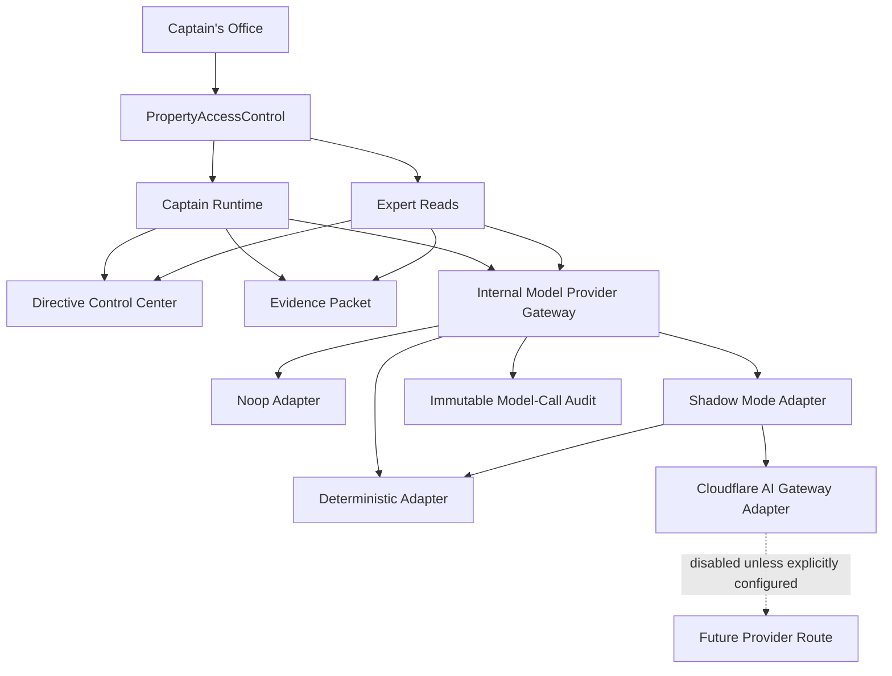
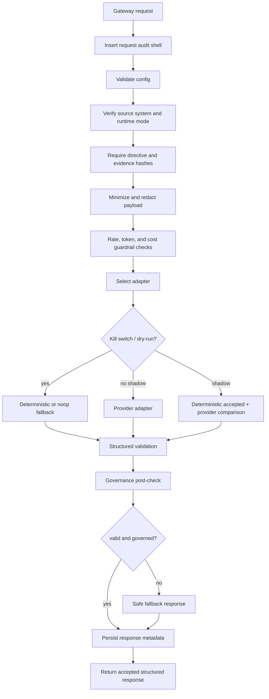
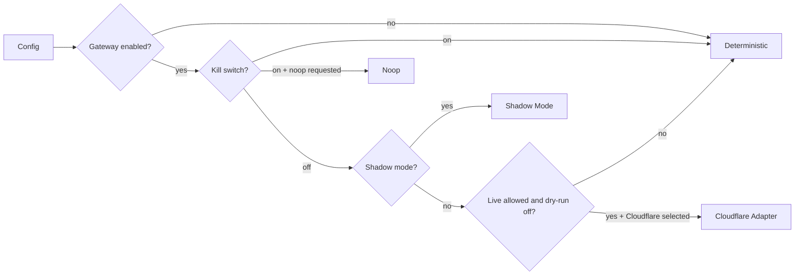
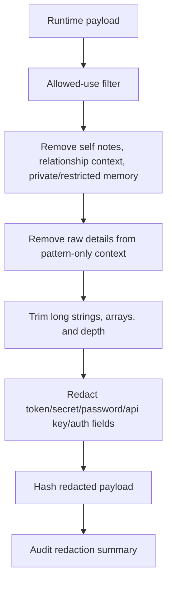

# Model Provider Gateway Audit Hardening - 2026-05-10

Status: hardened foundation gate
Readiness:

- `ready_for_shadow_mode_provider_config: true`
- `ready_for_live_provider_calls: false`
- `live_provider_calls_enabled: false`
- `deterministic_default_preserved: true`
- `cloudflare_adapter_live_enabled: false`

## Mission Boundary

This audit hardens the internal Model Provider Gateway before any live model provider is allowed to influence accepted runtime behavior. No live GPT/model calls, Cloudflare live calls, autonomous behavior, report publishing, memory promotion, Data Pond mutation, PIB coupling, or frontend provider access were added.

Cloudflare is an enhancer, not the solution. The internal gateway remains the application authority boundary for payload minimization, redaction, structured output validation, governance post-check, audit lineage, deterministic fallback, kill switch behavior, rate/cost guardrails, and shadow-mode isolation.

## Gateway Stack

## File Review

- `/apps/api/src/platform/model-gateway/types.ts`: typed source systems, call modes, output contracts, request/payload/response/audit records, adapter contracts, and execution input. Hardened so adapters can receive source-specific acceptance and governance callbacks for shadow validation.
- `/apps/api/src/platform/model-gateway/config.ts`: fail-closed defaults and config parsing. Hardened with explicit unsafe-config validation for ambiguous booleans, invalid adapter/source/runtime mode values, nonpositive limits, raw payload storage, raw provider logging, cache enablement, and unauthenticated Cloudflare posture.
- `/apps/api/src/platform/model-gateway/redaction.ts`: payload minimization, allowed-use filtering, sensitive-context removal, secret-key redaction, and deterministic redacted payload hashing. Hardened to exclude relationship context, private/restricted memory, sensitive memory, and raw details from pattern-only records.
- `/apps/api/src/platform/model-gateway/validation.ts`: structured output validators and governance post-check. Hardened to reject promoted memory candidates, Quartermaster/Fleet Scribe bypass attempts, self notes as evidence, relationship/people scoring, unauthorized external communication, directive/authorization changes, and provider self-routing/self-configuration.
- `/apps/api/src/platform/model-gateway/audit.ts`: D1 persistence helper for requests, redacted payload metadata, accepted/fallback responses, immutable audit events, and usage snapshots. Index naming was aligned with the migration.
- `/apps/api/src/platform/model-gateway/gateway.ts`: execution authority layer. Hardened to validate unsafe config before redaction/provider selection, enforce output token limits, pass source-specific validation/governance checks into adapters, and preserve safe fallback behavior.
- `/apps/api/src/platform/model-gateway/adapters/deterministic.ts`: deterministic accepted path; still default.
- `/apps/api/src/platform/model-gateway/adapters/noop.ts`: safe blocked/no-model fallback.
- `/apps/api/src/platform/model-gateway/adapters/cloudflare-ai-gateway.ts`: disabled live provider transport adapter; supports auth, route/model config, timeouts, error normalization, request/response ids, token usage, and safe fallback. It does not persist secrets or bypass internal validators/governance.
- `/apps/api/src/platform/model-gateway/adapters/shadow-mode.ts`: compare-only adapter. Hardened so provider shadow output receives both generic and source-specific validation/governance checks and cannot replace deterministic accepted output.
- `/apps/api/src/platform/captain-runtime/orchestrator.ts`: Captain Runtime uses the gateway abstraction while preserving deterministic accepted behavior, candidate-only memory, runtime validators, and governed routing.
- `/apps/api/src/platform/expert-reads/orchestrator.ts`: Expert Reads use the gateway abstraction while preserving deterministic accepted behavior, specialist contribution status, nonpublishable boundaries, and Expert Read validators.

## Migration And Persistence

App migration:

- `/apps/api/migrations/0052_create_model_provider_gateway.sql`

Infra migration:

- `/infra/migrations/0039_create_model_provider_gateway.sql`

The previously reported `034_create_model_provider_gateway.sql` filename was corrected because the infra chain already uses zero-padded `0034` through `0038` for the current governance stack. `0039_create_model_provider_gateway.sql` is the sequence-consistent next infra migration after Awareness Network `0038`. No duplicate migration was created.

Persistence hardening:

- request, payload, response, and audit tables are append-only through no-delete triggers
- request, payload, response, and audit records are immutable through update-blocking triggers
- request/response/audit rows preserve source system, actor, property, region, directive hash, evidence hash, payload hash, redacted payload hash, adapter, provider, route, call mode, validation/governance status, token usage, cost estimate, latency, reason, correlation id, and timestamp
- payload table stores redacted/minimized payload sections only; no raw prompt or secret persistence column exists
- foreign keys use `ON DELETE RESTRICT`
- indexes support source, property, actor, runtime, request, response, and correlation lookups

## Execution Flow

The gateway cannot act as a generic public completion API; it is called by governed server-side orchestrators with source system, runtime mode, directive snapshot, evidence packet, and output contract context.

## Adapter Selection And Kill Switch

Required safe defaults remain:

- `MODEL_GATEWAY_ENABLED=false`
- `MODEL_GATEWAY_ALLOW_LIVE_CALLS=false`
- `MODEL_GATEWAY_DEFAULT_ADAPTER=deterministic`
- `MODEL_GATEWAY_KILL_SWITCH=true`
- `MODEL_GATEWAY_SHADOW_MODE=false`
- `MODEL_GATEWAY_DRY_RUN=true`
- `MODEL_GATEWAY_STORE_RAW_PAYLOAD=false`
- `MODEL_GATEWAY_CACHE_ENABLED=false`
- `CLOUDFLARE_AI_GATEWAY_ENABLED=false`
- `CLOUDFLARE_AI_GATEWAY_REQUIRE_AUTH=true`
- `CLOUDFLARE_AI_GATEWAY_CACHE_ENABLED=false`

## Cloudflare Adapter

Cloudflare AI Gateway is only a provider-control transport. It may assist with routing, observability, rate limits, budget controls, DLP, and fallback routing, but it does not decide access, memory use, publishability, Quartermaster blocks, Fleet Scribe authority, or runtime behavior.

Live Cloudflare transit still requires a separate approval step and explicit runtime config:

- gateway enabled
- live calls allowed
- kill switch off
- dry-run off
- Cloudflare adapter enabled
- authenticated gateway token present when auth is required
- base URL and model/dynamic route configured
- internal validators and governance post-check still active

## Redaction Flow

Self notes are not evidence. Relationship context cannot become people scoring. Sensitive memory receives stricter treatment. Raw payloads and raw prompts are not stored by default.

## Validation And Governance

Structured validators cover:

- Captain Runtime response
- Expert Read response
- classification response
- reflection suggestion response
- evaluation response

Validators and post-checks reject malformed/prose-only output, hallucinated fields, invalid enum/confidence/publishability states, promoted memory candidates, report publication attempts, Data Pond mutation, Quartermaster/Fleet Scribe bypass, self notes as evidence, relationship scoring, unauthorized external communication, directive/authorization edits, and provider self-routing/self-configuration.

## Runtime Integrations

Captain Runtime:

- uses gateway abstraction
- deterministic behavior remains accepted default
- model output cannot mutate Data Pond, promote memory, publish reports, bypass Quartermaster, or bypass Fleet Scribe
- candidate memory remains noncanonical
- runtime validators still execute after gateway output
- fallback routes to blocked/Quartermaster-safe posture

Expert Reads:

- use gateway abstraction
- deterministic behavior remains accepted default
- Expert Reads remain specialist contributions, not reports
- publishability self-authorization remains blocked
- Fleet Scribe remains publication authority
- Quartermaster remains blocking
- fallback finalizes only as blocked/nonpublishable guidance

## Audit And Observability

Required events are implemented and covered by tests:

- `model_gateway.request_created`
- `model_gateway.payload_redacted`
- `model_gateway.kill_switch_blocked`
- `model_gateway.adapter_selected`
- `model_gateway.provider_call_started`
- `model_gateway.provider_call_completed`
- `model_gateway.provider_call_failed`
- `model_gateway.provider_timeout`
- `model_gateway.response_validation_failed`
- `model_gateway.governance_post_check_failed`
- `model_gateway.shadow_result_recorded`
- `model_gateway.fallback_used`
- `model_gateway.response_accepted`

Audit records preserve lineage without storing raw prompts or secrets.

## Tests

Primary test file:

- `/apps/api/test/platform/model-provider-gateway.test.ts`

Added/expanded coverage:

- safe disabled defaults
- unsafe config rejection
- raw payload/cache/raw-provider-output blocking
- migration numbering and immutability
- redaction of self notes, relationship context, private/restricted context, pattern-only raw detail, and secret-like fields
- malformed output rejection
- memory promotion rejection
- governance bypass rejection
- unsafe config fail-closed without payload persistence
- source allowlist, missing lineage, and oversized output fallback
- Cloudflare missing-auth and timeout fallback
- kill switch deterministic fallback
- shadow mode deterministic accepted output
- shadow source-specific governance failure recording

## Risk Matrix

Critical:

- None open. Live provider calls remain disabled and Cloudflare live path is not enabled.

High:

- Future live-call enablement could bypass safety if config is changed casually. Mitigation: unsafe config validation, kill switch, dry-run defaults, tests, and required separate approval.

Medium:

- Cloudflare route shape may need final production normalization once a real account/gateway route is selected. Mitigation: adapter isolation and no live enablement in this pass.
- Rate/cost guardrails are foundational counters, not a full enterprise budget ledger yet. Mitigation: enforced limits before adapter execution and audit events on fallback.

Low:

- Shadow deviation summaries currently compare schema/key shape, not semantic quality. This is sufficient for foundation gating but should be expanded before broad provider evaluation.

## Deferred Items

- real GPT/provider calls
- live Cloudflare AI Gateway enablement
- provider egress allowlisting and production route smoke test
- semantic evaluation harness for shadow outputs
- full budget ledger and provider billing reconciliation
- Model Provider Gateway UI/observability dashboard
- any memory promotion, report publishing, or autonomous behavior

## Readiness Decision

- `ready_for_shadow_mode_provider_config: true`
- `ready_for_live_provider_calls: false`
- `live_provider_calls_enabled: false`
- `deterministic_default_preserved: true`
- `cloudflare_adapter_live_enabled: false`

Required before live provider calls:

1. Separate explicit approval for live-call configuration.
2. Production Cloudflare account/gateway/route/token configuration review.
3. Provider egress and secret-management review.
4. Shadow-mode runbook execution with deterministic accepted output preserved.
5. Review of model-call audit trail and fallback behavior under simulated provider errors.
6. Formal rollback procedure with kill switch verification.

Recommended next prompt scope:

- Configure shadow-mode provider settings and run controlled non-authoritative provider comparisons. Do not allow provider output to become accepted runtime behavior.
