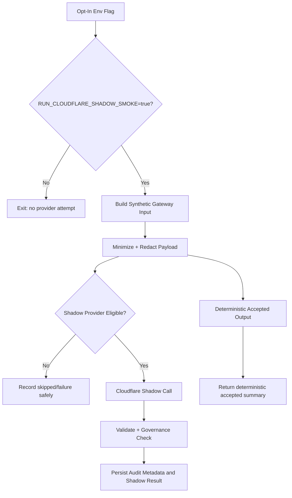

# Model Provider Gateway Cloudflare Shadow Smoke Test - 2026-05-10

## Purpose

The Cloudflare shadow smoke test is a backend-only, opt-in check that verifies provider configuration can be reached through the internal Model Provider Gateway without using real property data or changing accepted runtime behavior.

It is not part of normal CI and must not enable live accepted model behavior.

## Command

From `/Users/mark/Property_Analytics/apps/api`:

```bash
npm run smoke:cloudflare-shadow
```

By default the command reports that it did not attempt a provider call. To opt in:

```bash
RUN_CLOUDFLARE_SHADOW_SMOKE=true npm run smoke:cloudflare-shadow
```

The opt-in run still requires explicit shadow-only gateway and Cloudflare configuration. Missing config fails closed and prints no secrets.

## Synthetic Data Only

The smoke path uses:

- synthetic property id: `SYNTHETIC_SHADOW_PROPERTY`
- source system: `simulation`
- synthetic directive hash
- synthetic evidence packet hash
- harmless classification payload

It does not:

- create Captain memory
- create Expert Reads
- create routing
- create reports
- touch Data Pond
- expose provider output as accepted runtime behavior

## Flow



## Expected Output

The script prints sanitized JSON with:

- whether the smoke path was attempted
- whether Cloudflare was actually called
- accepted output source, which must remain `deterministic`
- gateway request id
- shadow result count
- safe fallback or skip reason where applicable

No token, raw prompt, raw provider payload, or raw provider output is printed.

Use the backend-only setup check before attempting real provider transit:

```bash
cd /Users/mark/Property_Analytics/apps/api
npm run model-gateway:check-cloudflare-shadow-config
```

## First Evaluation Result

The first controlled smoke run used explicit shadow flags but no backend Cloudflare base URL/model/token. Result:

- attempted: yes
- called Cloudflare: no
- accepted output source: deterministic
- shadow result count: 1
- reason: provider call skipped by configuration

This confirms missing Cloudflare config fails closed before provider transit while preserving deterministic accepted behavior.
