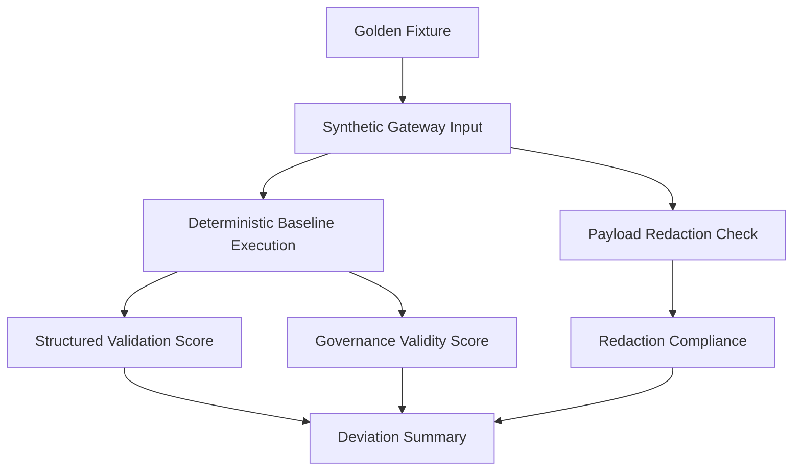

# Model Provider Gateway Golden-Case Evaluation - 2026-05-10

## Purpose

Golden-case evaluation establishes a repeatable pattern for comparing deterministic baseline behavior with optional shadow provider output.

Normal evaluation does not require live provider calls. It checks structural validity, governance validity, redaction compliance, and expected audit markers.

## Current Fixtures

The first fixture set covers:

- unverified amenity update
- self note appearing in context
- stale evidence
- Navigator public-copy suggestion from an unverified claim
- Expert Read unsupported publishability
- relationship context / people-judgment risk
- regional awareness summary

Each fixture includes:

- `fixture_id`
- `source_system`
- `runtime_mode`
- payload summary
- expected structural outcome
- expected governance outcome
- expected blocked states
- expected redactions
- expected audit markers

## Evaluation Flow



## Shadow Comparison

When provider shadow configuration is explicitly enabled, the same pattern can compare shadow provider output against the deterministic baseline. Provider output is still:

- redacted before transit
- structurally validated
- governance-checked
- recorded as shadow metadata only
- blocked from memory, routing, report, publication, and Data Pond side effects

## Current Test

Run:

```bash
cd /Users/mark/Property_Analytics/apps/api
npx tsx --test test/platform/model-provider-gateway.test.ts
```

The golden-case test asserts:

- at least seven fixture cases exist
- structural validity score is passing
- governance validity score is passing
- expected sensitive content is removed or redacted
- expected audit events are present

## Evaluation Runner

Check backend Cloudflare shadow eligibility first:

```bash
cd /Users/mark/Property_Analytics/apps/api
npm run model-gateway:check-cloudflare-shadow-config
```

Run the metadata-only evaluation pass:

```bash
cd /Users/mark/Property_Analytics/apps/api
npm run eval:gateway-shadow
```

For controlled fail-closed shadow evaluation without Cloudflare credentials:

```bash
MODEL_GATEWAY_ENABLED=true \
MODEL_GATEWAY_ALLOW_LIVE_CALLS=false \
MODEL_GATEWAY_PROVIDER_SHADOW_ENABLED=true \
MODEL_GATEWAY_PROVIDER_LIVE_ENABLED=false \
MODEL_GATEWAY_DEFAULT_ADAPTER=deterministic \
MODEL_GATEWAY_ACCEPTED_OUTPUT_ADAPTER=deterministic \
MODEL_GATEWAY_SHADOW_PROVIDER_ADAPTER=cloudflare_ai_gateway \
MODEL_GATEWAY_KILL_SWITCH=false \
MODEL_GATEWAY_SHADOW_MODE=true \
MODEL_GATEWAY_DRY_RUN=false \
CLOUDFLARE_AI_GATEWAY_ENABLED=true \
npm run eval:gateway-shadow
```

The runner prints sanitized configuration, aggregate fixture results, deterministic baseline scores, shadow skip/observation status, and usage metadata when available. It does not print raw prompts, raw provider output, or secrets.
