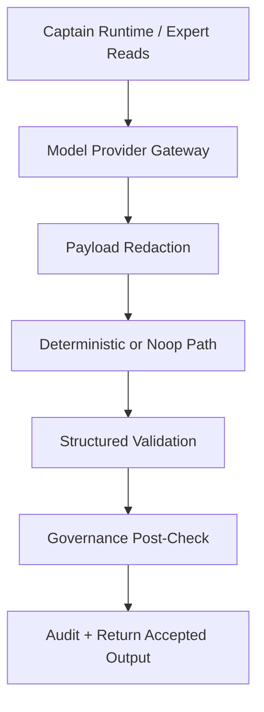
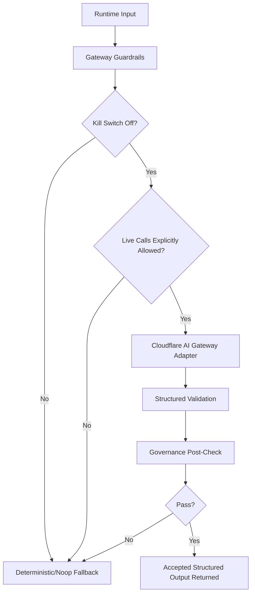

# Model Provider Gateway Operating Guide — 2026-05-10

## Default Runtime State

Safe default posture:

- `MODEL_GATEWAY_ENABLED=false`
- `MODEL_GATEWAY_ALLOW_LIVE_CALLS=false`
- `MODEL_GATEWAY_DEFAULT_ADAPTER=deterministic`
- `MODEL_GATEWAY_KILL_SWITCH=true`
- `MODEL_GATEWAY_SHADOW_MODE=false`
- `MODEL_GATEWAY_DRY_RUN=true`
- `MODEL_GATEWAY_STORE_RAW_PAYLOAD=false`
- `CLOUDFLARE_AI_GATEWAY_ENABLED=false`

## Modes

- `deterministic`
  - accepted output path
  - no provider call
- `noop`
  - safe blocked response
  - no provider call
- `dry_run`
  - provider path disabled
  - no external call
- `shadow`
  - deterministic accepted output
  - optional provider comparison only
- `live`
  - only allowed with explicit config
  - still requires structured validation and governance post-check

## How to Enable Shadow Mode Safely

Detailed backend-only Cloudflare shadow setup lives in:

- `/Users/mark/Property_Analytics/docs/MODEL_PROVIDER_GATEWAY_CLOUDFLARE_SHADOW_CONFIG_SETUP_2026-05-10.md`

1. Keep deterministic default.
2. Set:
   - `MODEL_GATEWAY_ENABLED=true`
   - `MODEL_GATEWAY_SHADOW_MODE=true`
   - `MODEL_GATEWAY_PROVIDER_SHADOW_ENABLED=true`
   - `MODEL_GATEWAY_ALLOW_LIVE_CALLS=false`
   - `MODEL_GATEWAY_PROVIDER_LIVE_ENABLED=false`
   - `MODEL_GATEWAY_ACCEPTED_OUTPUT_ADAPTER=deterministic`
   - `MODEL_GATEWAY_SHADOW_PROVIDER_ADAPTER=cloudflare_ai_gateway`
   - `MODEL_GATEWAY_KILL_SWITCH=false`
   - `MODEL_GATEWAY_DRY_RUN=false`
   - valid Cloudflare env
3. Review:
   - `model_gateway.shadow_provider_config_checked`
   - `model_gateway.shadow_provider_call_started` or `model_gateway.shadow_provider_skipped`
   - `model_gateway.shadow_result_recorded`
   - validation failures
   - governance failures
   - deviation summaries

Shadow mode must not drive accepted output. `MODEL_GATEWAY_ALLOW_LIVE_CALLS` remains false in this controlled provider-observation phase.

Before smoke or golden-case observation, run:

```bash
cd /Users/mark/Property_Analytics/apps/api
npm run model-gateway:check-cloudflare-shadow-config
```

## How to Reassert Safety Fast

Use any of:

- `MODEL_GATEWAY_KILL_SWITCH=true`
- `MODEL_GATEWAY_ALLOW_LIVE_CALLS=false`
- `CLOUDFLARE_AI_GATEWAY_ENABLED=false`
- `MODEL_GATEWAY_DEFAULT_ADAPTER=deterministic`

## Audit Events

Implemented events:

- `model_gateway.request_created`
- `model_gateway.payload_redacted`
- `model_gateway.kill_switch_blocked`
- `model_gateway.adapter_selected`
- `model_gateway.provider_call_started`
- `model_gateway.provider_call_completed`
- `model_gateway.provider_call_failed`
- `model_gateway.provider_timeout`
- `model_gateway.response_validation_failed`
- `model_gateway.governance_post_check_failed`
- `model_gateway.shadow_result_recorded`
- `model_gateway.fallback_used`
- `model_gateway.response_accepted`

## Dry Run Flow



## Live-Call Gated Flow



## Non-Negotiable Boundaries

- Cloudflare is an enhancer, not the solution
- internal Model Provider Gateway remains the authority boundary
- deterministic behavior remains default
- live model calls are disabled by default
- model output cannot mutate Data Pond
- model output cannot promote memory
- model output cannot publish reports
- PropertyAccessControl remains authoritative for access
- Directive Control Center remains authoritative for behavior
- Evidence Packets remain authoritative for reasoning scope
- Awareness memory remains care-governed and noncanonical
- Expert Reads remain specialist contributions
- Quartermaster remains blocking
- Fleet Scribe remains publication authority
