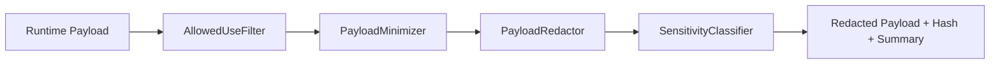

# Model Provider Gateway Security and Redaction — 2026-05-10

## Security Posture

The Model Provider Gateway is fail-closed.

Security rules:

- raw provider calls disabled by default
- raw payload storage disabled by default
- redacted payload storage on by default
- frontend cannot call providers directly
- secrets are env-only
- provider auth tokens are never logged
- model output cannot mutate Data Pond
- model output cannot promote memory
- model output cannot publish reports

## Payload Minimization

Implemented in:

- `/Users/mark/Property_Analytics/apps/api/src/platform/model-gateway/redaction.ts`

Components:

- `PayloadMinimizer`
- `PayloadRedactor`
- `SensitivityClassifier`
- `AllowedUseFilter`
- `PayloadHashBuilder`

## Redaction Rules

Removed context includes:

- raw prompts
- raw payload dumps
- self notes
- private notes
- relationship context
- care metadata

Redacted content includes:

- secrets
- tokens
- passwords
- API keys
- auth-bearing fields

Filtered memory includes:

- memory not allowed for `captain_reasoning` or `expert_read_context`
- agent self note style memory
- disallowed or blocked use classes

## Auditability

The gateway stores:

- payload hash
- redacted payload hash
- redaction summary
- structured response hash
- provider request metadata when available

The gateway does not store raw prompts by default.

## Redaction Flow

