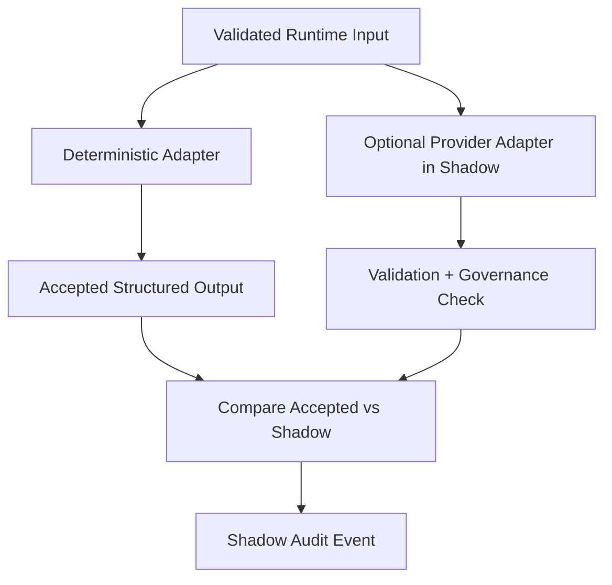

# Model Provider Gateway Shadow Mode — 2026-05-10

## Purpose

**Shadow Mode** allows provider-path evaluation without changing accepted runtime output.

Accepted path:

- deterministic adapter

Shadow path:

- optional provider adapter, if explicitly enabled

## Rules

- deterministic accepted output remains authoritative
- provider shadow output is validated
- governance post-check still runs
- differences are recorded
- shadow output cannot drive persistence
- shadow output cannot publish
- shadow output cannot promote memory
- shadow output cannot mutate Data Pond

## Flow

## Evaluation Hooks

The foundation now supports recording:

- payload hash
- redacted payload hash
- output hash
- provider model id
- provider route / request id when available
- validation outcome
- governance outcome
- deviation summary
- token usage, cost estimate, and latency when available
- safe provider error type and message when applicable

This is intended for future golden-case and hardening evaluation, not autonomous learning.

## Shadow Provider Configuration

Controlled Cloudflare shadow observation is documented in:

- `/Users/mark/Property_Analytics/docs/MODEL_PROVIDER_GATEWAY_SHADOW_PROVIDER_CONFIG_2026-05-10.md`
- `/Users/mark/Property_Analytics/docs/MODEL_PROVIDER_GATEWAY_CLOUDFLARE_SHADOW_SMOKE_TEST_2026-05-10.md`
- `/Users/mark/Property_Analytics/docs/MODEL_PROVIDER_GATEWAY_GOLDEN_CASE_EVALUATION_2026-05-10.md`

In this phase:

- deterministic output remains accepted
- provider output is shadow-only
- `MODEL_GATEWAY_ALLOW_LIVE_CALLS=false`
- `MODEL_GATEWAY_PROVIDER_LIVE_ENABLED=false`
- no provider output can create memory, routing, reports, publication, or Data Pond side effects
