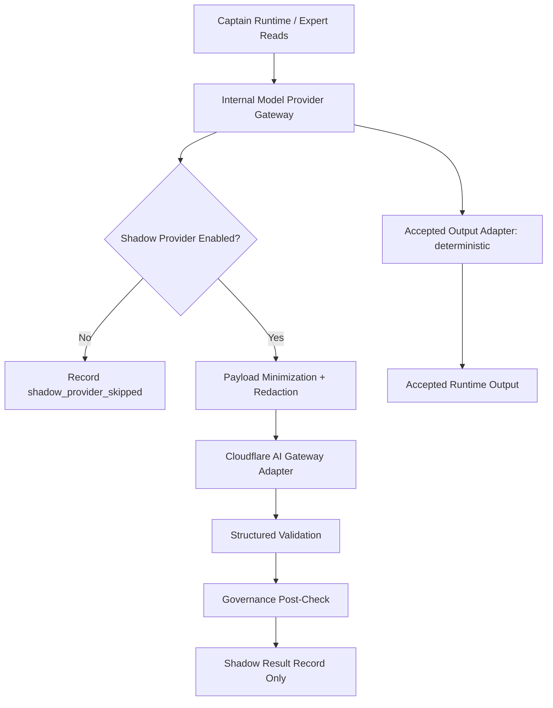

# Model Provider Gateway Shadow Provider Configuration - 2026-05-10

## Purpose

This pass configures Cloudflare AI Gateway for **shadow observation only** through the internal Model Provider Gateway.

Accepted output remains deterministic. Provider output is observed, validated, governance-checked, compared, and audited, but it cannot drive Captain Runtime, Expert Reads, memory, routing, reports, publication, or Data Pond mutation.

## Configuration Model

## Required Shadow-Only Flags

- `MODEL_GATEWAY_ENABLED=true`
- `MODEL_GATEWAY_SHADOW_MODE=true`
- `MODEL_GATEWAY_PROVIDER_SHADOW_ENABLED=true`
- `MODEL_GATEWAY_PROVIDER_LIVE_ENABLED=false`
- `MODEL_GATEWAY_ALLOW_LIVE_CALLS=false`
- `MODEL_GATEWAY_DEFAULT_ADAPTER=deterministic`
- `MODEL_GATEWAY_ACCEPTED_OUTPUT_ADAPTER=deterministic`
- `MODEL_GATEWAY_SHADOW_PROVIDER_ADAPTER=cloudflare_ai_gateway`
- `MODEL_GATEWAY_KILL_SWITCH=false`
- `MODEL_GATEWAY_DRY_RUN=false`
- `MODEL_GATEWAY_STORE_RAW_PAYLOAD=false`
- `MODEL_GATEWAY_LOG_RAW_PROVIDER_OUTPUT=false`
- `MODEL_GATEWAY_CACHE_ENABLED=false`
- `CLOUDFLARE_AI_GATEWAY_ENABLED=true`
- `CLOUDFLARE_AI_GATEWAY_REQUIRE_AUTH=true`
- `CLOUDFLARE_AI_GATEWAY_CACHE_ENABLED=false`

## Cloudflare Placeholders

Use backend-only environment values. Documentation must use placeholder names only:

- `CLOUDFLARE_AI_GATEWAY_ACCOUNT_ID`
- `CLOUDFLARE_AI_GATEWAY_ID`
- `CLOUDFLARE_AI_GATEWAY_BASE_URL`
- `CLOUDFLARE_AI_GATEWAY_AUTH_TOKEN`
- `CLOUDFLARE_AI_GATEWAY_ROUTE_NAME`
- `CLOUDFLARE_AI_GATEWAY_MODEL`
- `CLOUDFLARE_AI_GATEWAY_PROVIDER`

## Safety Rules

- missing Cloudflare config fails closed
- invalid Cloudflare config fails closed
- unsafe live-provider flags fail closed
- accepted output adapter must remain deterministic
- shadow provider adapter must be Cloudflare AI Gateway
- raw payloads and raw provider output are not stored by default
- Cloudflare token is never logged, persisted, placed in audit events, or exposed to frontend code
- Cloudflare remains infrastructure; internal validation and governance remain mandatory

## Disable / Rollback

Any of the following disables provider observation:

- `MODEL_GATEWAY_PROVIDER_SHADOW_ENABLED=false`
- `MODEL_GATEWAY_SHADOW_MODE=false`
- `MODEL_GATEWAY_KILL_SWITCH=true`
- `MODEL_GATEWAY_DRY_RUN=true`
- `CLOUDFLARE_AI_GATEWAY_ENABLED=false`

Live accepted provider calls remain out of scope for this phase.
