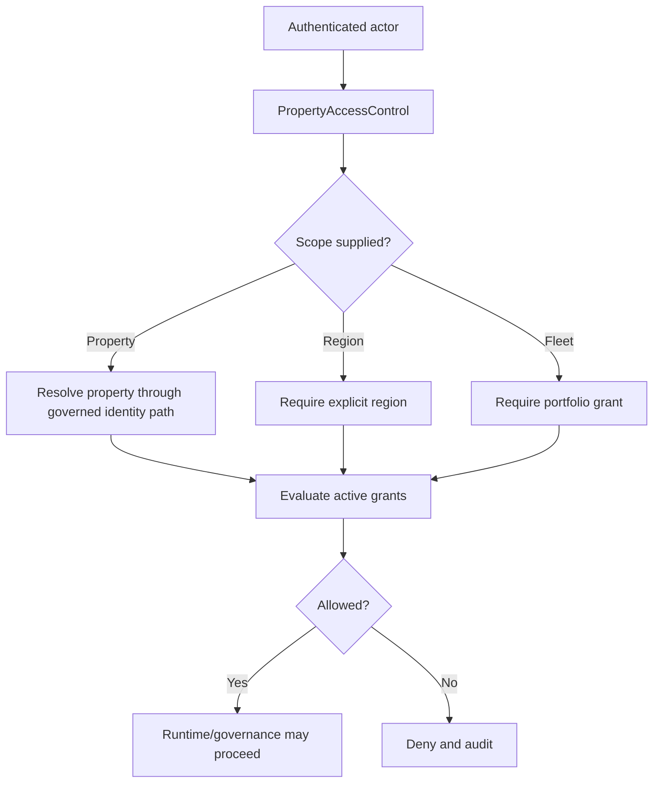
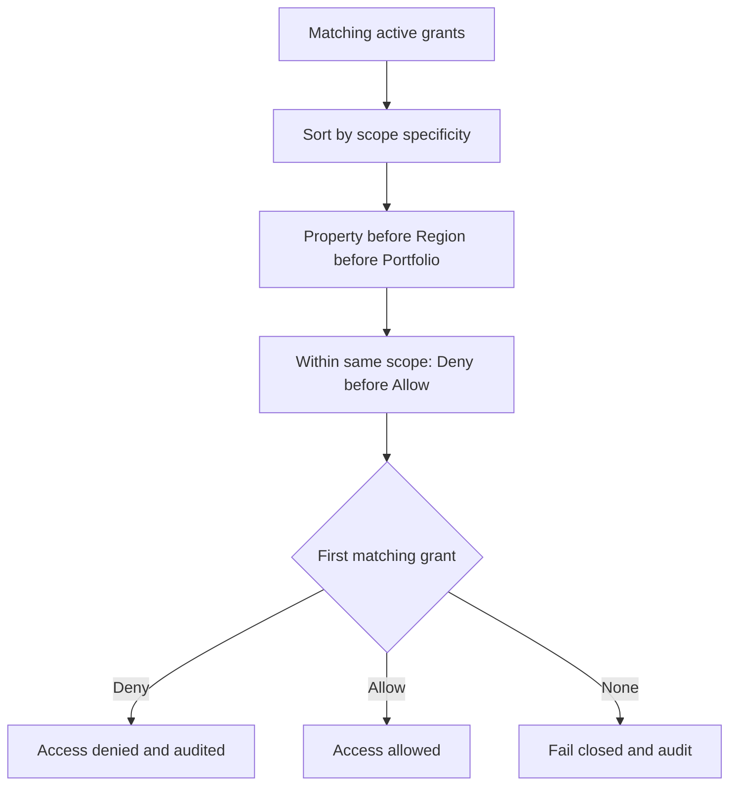
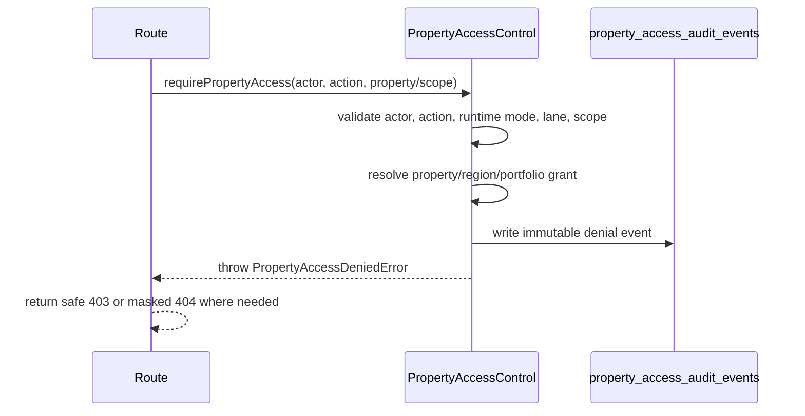

# Property Access Control Architecture

Date: 05/10/2026

## Purpose

Property Access Control is the canonical property-scoped authorization layer for the Data Pond / Captain runtime ecosystem.

It answers one question before runtime governance begins:

> Can this actor perform this action on this property in this runtime context?

This layer does not replace session auth, role checks, Directive Resolver governance, Quartermaster source integrity, Fleet Scribe publication controls, or Data Pond source authority. It gates access before those systems run.

## Canonical Service

Implementation:

- `/Users/mark/Property_Analytics/apps/api/src/platform/access/property-access-control.ts`

Persistent tables:

- `property_access_grants`
- `property_access_audit_events`

Migrations:

- `/Users/mark/Property_Analytics/apps/api/migrations/0050_create_property_access_control.sql`
- `/Users/mark/Property_Analytics/infra/migrations/0037_create_property_access_control.sql`

The service exposes:

- `canViewProperty`
- `canInteractWithCaptain`
- `canRequestExpertRead`
- `canViewExpertRead`
- `canUseRuntimeMode`
- `canViewRuntimeHistory`
- `canViewEvidenceLineage`
- `canViewMemoryCandidates`
- `canOperateCaptainOffice`
- `canAccessFleetScope`
- `canAccessRegionScope`

Routes should use `requirePropertyAccess` when access is mandatory. Local one-off property authorization should not be added to runtime surfaces.

## Scope Model

Supported grant scopes:

- `property`: grants access to one resolved property id or community id.
- `region`: grants access to properties in a specific region or to explicit region-scope actions.
- `portfolio`: grants portfolio/fleet-level access.

Supported authorization dimensions:

- property scope
- region scope
- portfolio scope
- role/capability scope
- runtime-mode scope
- Expert Read lane scope
- read/write/request/admin distinctions through capabilities

Property resolution uses the governed runtime property identity path, not local report maps.

## Actor Model

The service uses the existing authenticated actor model:

- actor id
- actor role
- existing role values: `admin`, `editor`, `viewer`

It does not create a parallel user system.

Explicit grants define:

- allowed property ids
- allowed regions
- allowed capabilities
- allowed runtime modes
- allowed Expert Read lanes
- grant effect: `allow` or `deny`

Admin users remain superusers after the requested property/scope is resolvable. Missing or unresolvable property scope still fails closed for property-scoped actions.

## Grant Precedence Rules

Grant resolution is deterministic.

1. Only active, unexpired grants are considered.
2. Scope specificity wins:
   - property grant
   - region grant
   - portfolio grant
3. Within the same specificity, `deny` wins over `allow`.
4. Runtime-mode restrictions are checked before grant matching for role-level safety.
5. Unsupported actions, runtime modes, and Expert Read lanes deny before grant matching.

Examples:

- A property-level allow overrides a broader region-level deny.
- A property-level deny overrides a property-level allow.
- A region-level deny overrides a portfolio-level allow.
- A lane allow cannot override a runtime-mode denial.

## Runtime Mode Authorization

Supported runtime modes:

- `monitoring`
- `lightweight`
- `standard`
- `escalated`
- `executive`
- `simulation`

Runtime mode rules:

- `admin`: all modes
- `editor`: `monitoring`, `lightweight`, `standard`
- `viewer`: monitoring-only at the authorization primitive, with route-level mutations still role-blocked

Editors/operators cannot force `escalated`, `executive`, or `simulation` unless future role policy explicitly permits it and the service is updated deliberately.

## Expert Lane Authorization

Expert Read lane access is explicit.

Examples:

- A user may request/view Navigator reads but not Revenue Advisor reads.
- A user may view a property but not request Expert Reads.
- Fleet/Scribe contexts may receive broader grants through portfolio scope.

If a property grant exists but the requested lane is not included, the service denies with lane scope and the Expert Reads API returns a safe `FORBIDDEN_EXPERT_LANE` response.

## Integration Rules

Current integrations:

- Captain Runtime interaction route
- Captain’s Office state route
- Captain Runtime history route
- Captain Runtime evidence lineage route
- Captain Runtime memory candidate route
- Expert Read request route
- Expert Read property/lane/detail read routes

Required rule for future work:

No runtime surface should implement one-off property authorization. Frontend checks are not a security boundary.

## Audit Events

Denied and high-risk authorization decisions are audited.

Captured fields:

- actor
- actor role
- property id
- community id
- region
- requested action
- requested scope
- runtime mode
- lane id
- decision
- reason
- high-risk flag
- correlation id
- timestamp

Audit rows are immutable and cannot be deleted.

High-risk decisions include:

- `escalated`
- `executive`
- `simulation`
- fleet-scope access
- region-scope access

## Fail-Closed Policy

The service denies by default when:

- actor is missing or malformed
- property id is missing
- property id is stale, ambiguous, or unresolvable
- region scope is requested without a region
- no active grant permits the requested capability
- no active grant permits the requested runtime mode
- no active grant permits the requested Expert Read lane

Fail-closed decisions are audited.

## Denial Flow

## Governance Boundary

Authorization is not runtime governance.

Authorization answers whether an actor may access a property-scoped action. After that:

- Captain Runtime still resolves directives.
- Evidence packets still govern reasoning scope.
- Quartermaster source integrity remains blocking.
- Fleet Scribe remains publication authority.
- Expert Reads remain governed specialist contributions.
- Data Pond remains the source of canonical facts.

No GPT, report, PIB, Fleet Scribe, memory-promotion, or publication behavior is changed by this layer.
