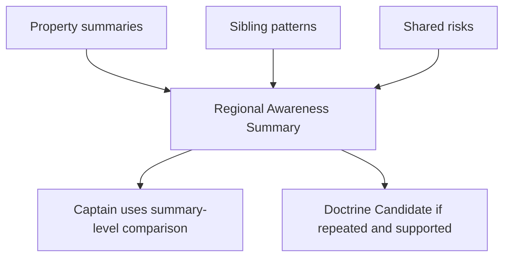

# Regional Awareness Model

Date: 05/10/2026

## Purpose

Regional Awareness lets Captains and Commodores learn from sibling-property business patterns without exposing unnecessary raw local detail.

It supports:

- sibling property high-level posture
- shared market pressure
- regional demand/conversion patterns
- common content gaps
- source freshness issues
- similar watch items
- tactics that appear to work elsewhere
- cautionary regional patterns

## Boundary

Regional Awareness is summary-level. It must not expose private self notes, sensitive relationship context, unauthorized property data, or raw local narratives.

Captains may consume regional summaries only when PropertyAccessControl allows the region or relevant property scope. Commodore is the natural steward.

