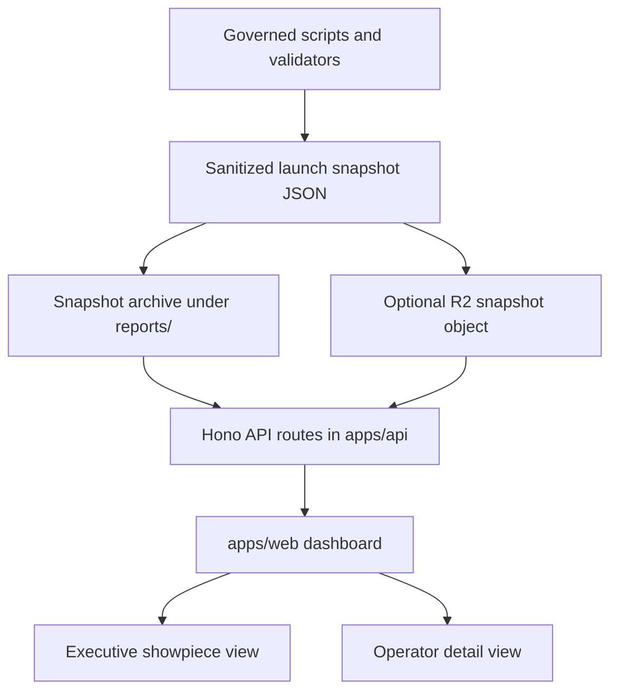

# Resi Edge Portfolio Launch Dashboard Hono Proposal

Status: Proposal / non-mutating design
Date: 08/17/2026
Owner: WebOps / Property Analytics
Proposed implementation lane: existing Hono-backed `apps/api` plus `apps/web`

## Executive Summary

Use Hono as the read-only API layer for a portfolio launch dashboard that presents Resi Edge rollout readiness, proof status, blockers, and launch timing in a polished executive/operator surface.

The dashboard should not become a deployment tool. It should be a confidence surface: fast, attractive, drillable, and grounded in already-generated governed evidence packets. Existing scripts remain responsible for validation, source reconciliation, and mutation gates. Hono should expose sanitized launch snapshots through clean routes that the dashboard can consume.

This fits the current system because `apps/api` already uses Hono on Cloudflare Workers, and `apps/web` is already the governed UI growth surface. The proposal is therefore an extension of the existing stack, not a new framework fork.

## Current Context

Relevant existing truths:

- `apps/api/package.json` already depends on `hono`.
- `apps/api/src/index.ts` already mounts Hono route groups under `/v1`.
- `apps/web` is the canonical governed UI surface for new product UI.
- The legacy `Portfolio_Dashboard` is classified as `Legacy-Reusable`, not the default shell for new dashboard work.
- Resi Edge deployment remains governed by `scripts/run_resi_edge_upgrade.py`.
- Phase 2 launch preparation is documented in `docs/RESI_EDGE_PORTFOLIO_LAUNCH_PHASE_2_PREP_2026-08-14.md`.
- Phase 2 launch data currently lives in generated packets under `reports/resi_edge_performance/`, `reports/ahrefs_admin/`, and `reports/ga4_admin/`.

The important design implication: build a dashboard that reads governed outputs. Do not rebuild the truth logic in the dashboard.

## Product Goal

Create a launch-facing dashboard for Resi Edge portfolio rollout that can serve two audiences:

1. Executive / showpiece mode
   - Clean overview of launch progress and readiness.
   - Attractive, high-confidence visual presentation.
   - Redacted or summarized enough for broader viewing.
   - Emphasizes momentum, proof, next gates, and timeline.

2. Operator detail mode
   - Property-level readiness details.
   - Gate-by-gate blockers.
   - Evidence packet links.
   - Source-readiness state across manifests, Ahrefs, GA4, vanity URLs, GSC, Captain/Data Pond, R2 assets, and live proof packets.
   - No production mutation controls.

## Non-Goals

- Do not replace `scripts/run_resi_edge_upgrade.py`.
- Do not modify the canonical Resi Edge Worker/runtime/package.
- Do not create a property-specific Worker fork.
- Do not touch locked PIB files.
- Do not send emails.
- Do not patch GA4, Ahrefs, Cloudflare, WordPress, DNS, R2, Zaraz, GSC, Captain, or Data Pond from the dashboard.
- Do not introduce local credential files, ad hoc `.env` secrets, or browser-login credential paths.
- Do not make dashboard-displayed model or narrative output authoritative without source validation.

## Proposed Architecture



### Data Production

Keep source-of-truth generation in the existing Python/Node script lane.

Candidate snapshot producers:

- `scripts/build_resi_edge_cohort_readout.py`
- `scripts/build_resi_edge_phase2_preflight.py`
- `scripts/build_resi_edge_phase2_manifest_prep.py`
- `scripts/build_resi_edge_phase2_analytics_profile_plan.py`
- `scripts/build_resi_edge_phase2_ahrefs_vanity_project_plan.py`
- `scripts/build_resi_edge_phase2_ga4_default_uri_plan.py`

Add a future aggregator only if needed:

- `scripts/build_resi_edge_launch_dashboard_snapshot.py`

The aggregator should be non-mutating. It should collect the latest relevant packet paths, normalize human-facing fields, redact provider-sensitive details, and write a single dashboard contract.

Suggested output:

- `reports/resi_edge_performance/launch-dashboard/latest.json`
- `reports/resi_edge_performance/launch-dashboard/snapshots/resi-edge-launch-dashboard-YYYYMMDDTHHMMSSZ.json`
- `reports/resi_edge_performance/launch-dashboard/snapshots/resi-edge-launch-dashboard-YYYYMMDDTHHMMSSZ.md`

### Hono API Layer

Use the existing `apps/api` Hono Worker unless deployment isolation becomes important.

Proposed route group:

- `apps/api/src/routes/resi-edge-launch.ts`

Proposed mounts:

- `/v1/resi-edge-launch/health`
- `/v1/resi-edge-launch/latest`
- `/v1/resi-edge-launch/cohorts`
- `/v1/resi-edge-launch/cohorts/:cohortId`
- `/v1/resi-edge-launch/properties`
- `/v1/resi-edge-launch/properties/:propertyCode`
- `/v1/resi-edge-launch/properties/:propertyCode/evidence`
- `/v1/resi-edge-launch/timeline`
- `/v1/resi-edge-launch/blockers`
- `/v1/resi-edge-launch/showpiece`

API responsibilities:

- Serve a normalized, typed, read-only launch snapshot.
- Apply redaction rules.
- Format user-facing dates as `MM/DD/YYYY`.
- Emit cache headers suitable to snapshot freshness.
- Return clear snapshot metadata: generated time, source packet paths, source script versions if available, and staleness state.
- Enforce Access/session policy for operator endpoints.
- Keep showpiece endpoints safe for broader sharing if explicitly approved.

### Frontend Layer

Use `apps/web`, not the legacy portfolio dashboard, as the primary UI surface.

Potential route:

- `/resi-edge/launch`

Potential views:

- Portfolio overview
- Phase timeline
- Cohort readiness
- Property drilldown
- Blocker board
- Evidence browser
- Executive showpiece mode

Visual direction:

- Quiet, polished operational dashboard rather than marketing landing page.
- Use Venterra brand palette only.
- Use dense but readable layouts for operator detail.
- Keep showpiece mode more cinematic, but still source-grounded.
- Avoid visible instructional copy and avoid explaining the UI inside the UI.
- Prefer icon buttons, status chips, tabs, filters, and drilldowns.

## Suggested Snapshot Contract

High-level shape:

```json
{
  "schema_version": "resi_edge_launch_dashboard_snapshot_v1",
  "generated_at": "2026-08-17T00:00:00Z",
  "generated_for_display": "08/17/2026",
  "mode": "read_only",
  "source_packets": [],
  "summary": {
    "phase": "Phase 2",
    "total_properties": 20,
    "ready": 0,
    "needs_attention": 20,
    "blocked": 0,
    "launch_date": "08/19/2026"
  },
  "cohorts": [],
  "properties": [],
  "timeline": [],
  "blockers": [],
  "evidence": []
}
```

Property row fields should include:

- property code
- display name
- vanity domain
- staging URL when available
- phase
- launch date
- identity resolution state
- manifest state
- Ahrefs state
- GA4 state
- GSC state
- Captain/Data Pond state
- source phone state
- asset readiness state
- stage/live proof state
- current blocker labels
- latest evidence packet path
- last refreshed display date

## Access And Redaction

Recommended access modes:

1. Internal operator mode
   - Behind normal app auth or Cloudflare Access.
   - Can include local evidence path labels, blocker details, and source packet references.

2. Executive showpiece mode
   - Authenticated or link-limited.
   - Redacts local filesystem paths, raw provider IDs, raw response payloads, and sensitive operational detail.
   - Shows evidence confidence without exposing internal mechanics.

3. Public demo mode, only if explicitly approved
   - No raw property source packets.
   - No provider IDs.
   - No internal route names.
   - No evidence paths.
   - No detailed blockers that reveal security, credentials, vendor limits, or operational exposure.

## Hono Fit

Hono is valuable here because it gives us:

- Route grouping that matches the existing `apps/api` pattern.
- Lightweight Cloudflare Worker compatibility.
- Middleware for auth, CORS, cache headers, and redaction.
- TypeScript route contracts that can feed the Next.js dashboard cleanly.
- A future path to separate this as a standalone Worker if the launch dashboard needs independent access or caching.

Hono should not be used here because it is trendy. It should be used because the repo already has it, Cloudflare Workers are already part of the operating model, and this feature is a clean read-only API problem.

## Governance

Required guardrails:

- Use Keeper/KSM for any future Cloudflare deployment credential path.
- Do not add local credential files.
- Resolve property identity through `Data_Collection/utils/property_identity.py` or current identity matrix-backed helpers before property-scoped automation changes.
- Do not write a parallel property identity map.
- Do not touch locked PIB files.
- Do not modify the canonical Resi Edge runtime or Worker without explicit approval.
- Keep all mutation actions outside the dashboard.
- Preserve ISO dates for filenames and JSON internals; use `MM/DD/YYYY` for human-facing labels.
- Use only the official Venterra brand palette for new UI.

## Implementation Phases

### Phase 0: Static Design Prototype

Goal: prove the dashboard composition without connecting live APIs.

Work:

- Create a mock snapshot from existing Phase 2 packet shapes.
- Build the `/resi-edge/launch` page against local static JSON.
- Include desktop and mobile responsive views.
- Verify visual quality with Playwright screenshots.

Exit criteria:

- The dashboard tells the launch story clearly.
- Text fits across desktop and mobile.
- Executive showpiece and operator detail modes are visually distinct.
- No live provider calls or mutations exist.

### Phase 1: Snapshot Builder

Goal: create the non-mutating data contract.

Work:

- Add `scripts/build_resi_edge_launch_dashboard_snapshot.py`.
- Read latest governed packet outputs.
- Normalize and redact fields.
- Write JSON and Markdown snapshot evidence.
- Validate snapshot schema.

Exit criteria:

- Snapshot generation is repeatable.
- Missing packet conditions are explicit.
- Redaction is testable.
- Output can be consumed without opening raw provider evidence.

### Phase 2: Hono API

Goal: expose the snapshot through typed read-only routes.

Work:

- Add `apps/api/src/routes/resi-edge-launch.ts`.
- Mount under `/v1/resi-edge-launch`.
- Add schema validation and redaction tests.
- Decide whether Hono reads from D1, R2, or a deployed snapshot bundle.

Exit criteria:

- API returns the latest snapshot.
- API returns per-property drilldowns.
- API has safe cache headers and clear staleness metadata.
- Operator endpoints are auth-gated.

### Phase 3: Connected Dashboard

Goal: connect `apps/web` to the Hono API.

Work:

- Replace mock data with API fetches.
- Add loading, empty, stale, and error states.
- Add property filters and cohort tabs.
- Add executive showpiece mode.

Exit criteria:

- Dashboard works from current API data.
- Playwright screenshots pass desktop/mobile checks.
- User-facing dates render as `MM/DD/YYYY`.
- Venterra palette is enforced.

### Phase 4: Share/Show Mode

Goal: make the dog-and-pony version impressive and safe.

Work:

- Create a redacted showpiece endpoint.
- Add share-safe dashboard mode.
- Add optional generated summary cards from existing snapshot facts.
- Consider Sites deployment only if the user wants a separate shareable public site.

Exit criteria:

- No sensitive paths, secrets, raw vendor IDs, or operational details leak.
- Show mode reads as polished and confident.
- Operator truth remains available in the authenticated app.

## Risks And Mitigations

Risk: Dashboard becomes another source of truth.
Mitigation: dashboard reads generated evidence only and displays source packet metadata.

Risk: Public mode leaks internal blocker details.
Mitigation: separate showpiece contract and redaction tests.

Risk: Team expects live launch control.
Mitigation: no mutation endpoints, no deploy buttons, no route-change controls.

Risk: Resi Edge governance is accidentally bypassed.
Mitigation: keep `scripts/run_resi_edge_upgrade.py` as the only deployment interface.

Risk: UI becomes too flashy and loses operational value.
Mitigation: build executive showpiece and operator detail as modes on the same source truth.

## Recommended Decision

Proceed with Phase 0 and Phase 1 as a non-mutating buildout. Use the existing Hono API pattern in `apps/api` for Phase 2 only after the snapshot contract is approved.

The first concrete deliverable should be a static dashboard prototype plus a dashboard snapshot schema. That gives the project thread something real to review without touching live routes, credentials, PIB, or canonical Resi Edge deployment behavior.

