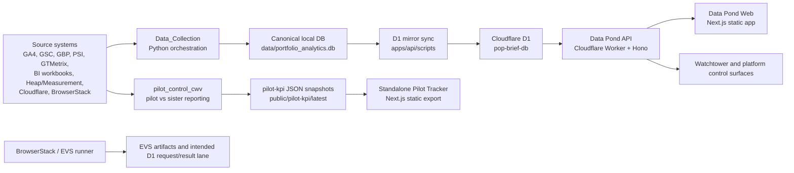

# Resi Platform Technical Documentation

Status: Draft baseline
Date: 05/26/2026
Owner: Property Analytics / MarketingOps
Scope: Resi pilot platform, Data Pond backbone, pilot tracker, collection pipeline, Cloudflare runtime, and validation lanes

## 1. Purpose

Document the technical architecture for the Resi platform as it exists in this repository and as observed from the currently public endpoints.

This document is a platform-level technical baseline. It intentionally does not change or redefine canonical PIB rendering, alternate PIB templates, or locked PIB files.

## 2. Executive Summary

The Resi platform is a layered operating system for pilot-property monitoring and property intelligence:

- Local Python collection jobs gather portfolio and pilot data into the canonical local SQLite database.
- A Cloudflare Workers API exposes governed Data Pond routes backed by Cloudflare D1 and R2 bindings.
- A Next.js Data Pond web app provides operator surfaces such as Watchtower, metrics import, analysis, Intelligence Office, Site Content, and reporting views.
- A standalone pilot tracker app renders the Resi pilot KPI dashboard from static JSON snapshots.
- EVS/BrowserStack tooling validates real-device site experience and is intended to feed request/result history back into the platform.
- Cloudflare Access / Zero Trust is the intended outer trust boundary, while app sessions and role checks enforce application authorization.

Current deployment observation:

- `https://api.venterradev.com/health` returns `200` with `{"status":"ok","version":"1.0.0"}`.
- Authenticated platform routes such as `/v1/pond/landscape` and `/v1/health/status` return `401 NO_SESSION` without a valid app session, which matches the session-protected model.
- `https://pilot.venterradev.com/` currently returns a Kinsta/WordPress-backed page through Cloudflare.
- `https://pilot.venterradev.com/pilot-kpi/latest/overview.json`, `/cwv`, `/traffic`, `/funnel`, and `/archive` returned `404` during this review, so the standalone tracker is not currently observable at that hostname.
- The standalone tracker deployment notes target `tracker.venterradev.com`, not `pilot.venterradev.com`.

## 3. System Boundary

In scope:

- `apps/api` Cloudflare Worker API.
- `apps/web` Data Pond web app.
- `apps/pilot-tracker-standalone` static pilot tracker app.
- `pilot_control_cwv` Resi pilot KPI and CWV reporting pipeline.
- `Data_Collection` canonical collection orchestration.
- `evs` BrowserStack validation tooling.
- Cloudflare Pages, Workers, D1, R2, Access, cache, and TLS posture relevant to these surfaces.

Out of scope:

- Canonical PIB generation/rendering internals.
- Alternate PIB renderers or templates.
- Business process documentation not directly tied to platform runtime behavior.
- Third-party admin console procedures except where needed for deployment, SSL, or cache posture.

## 4. High-Level Architecture



## 5. Runtime Inventory

| Layer | Repository path | Runtime | Primary role |
| --- | --- | --- | --- |
| Data collection | `Data_Collection/` | Python + launchd/local operator runtime | Daily source collection, retry, data quality, freshness monitoring |
| Canonical local database | `data/portfolio_analytics.db` | SQLite | Local truth root for normalized portfolio data |
| D1 mirror | `apps/api/scripts/d1_mirror_sync.py` | Python + Wrangler/Cloudflare auth | Mirrors validated local state into Cloudflare D1 |
| API | `apps/api/` | Cloudflare Workers + Hono | Governed HTTP API, auth, platform routes, D1/R2 access |
| Web app | `apps/web/` | Next.js 14 static export on Cloudflare Pages | Data Pond operator UI |
| Pilot tracker | `apps/pilot-tracker-standalone/` | Next.js 14 static export on Cloudflare Pages | Resi pilot KPI dashboard from static snapshots |
| Pilot KPI reporting | `pilot_control_cwv/` | Python reporting pipeline | Pilot/control CWV, GTMetrix, traffic, funnel, workbook/email/dashboard snapshots |
| EVS | `evs/` | Node.js + Playwright + BrowserStack | Real-device experiential validation lane |
| Edge/security | Cloudflare | DNS, TLS, Pages, Workers, Access, cache rules | Public edge, trust boundary, runtime deployment |

## 6. Public and Intended Hostnames

| Host | Intended role | Current observation |
| --- | --- | --- |
| `api.venterradev.com` | Data Pond API | `/health` public check succeeds; authenticated routes require session |
| `app.venterradev.com` | Data Pond web app | Referenced as the canonical frontend origin in API CORS and app architecture |
| `pilot.venterradev.com` | Pilot monitoring/reporting surface in architecture docs | Live endpoint currently appears Kinsta/WordPress-backed; tracker paths 404 |
| `tracker.venterradev.com` | Standalone pilot tracker target from `DEPLOYMENT.md` | Intended Cloudflare Pages custom domain for `apps/pilot-tracker-standalone` |
| `vacs.venterradev.com` | VACS/content machine lane target | Architectural target, not covered as live in this review |
| `specs.venterradev.com` | Standards/governance layer target | Architectural target, not covered as live in this review |

## 7. Data Sources and Collection

The canonical collection system lives in `Data_Collection/` and consolidates source logic that previously lived across older report/dashboard folders.

Primary inputs:

- GA4 and GSC performance data.
- GBP reviews and insights.
- PageSpeed Insights and GTMetrix performance data.
- BI and guest-card workbooks.
- Marketing, paid-media, and website SEO inputs.
- Cloudflare cache/edge data.
- BrowserStack/EVS validation outputs.

Canonical local state:

- Database: `data/portfolio_analytics.db`.
- Property registry: `config/venterra_properties_official.json`.
- Collection status tables include `data_collections`, `collection_errors`, and related monitoring/freshness tables.

Scheduled operating model:

- Main collection: daily local job.
- Health reports: daily local job.
- D1 mirror sync: dedicated phase in the daily collection chain.
- Retry/recovery: handled through collection retry orchestration and source freshness policy.

## 8. Pilot KPI Pipeline

The Resi pilot tracker uses a separate pilot/control reporting pipeline under `pilot_control_cwv/`.

Key characteristics:

- Keeps pilot vanity-domain history separate from portfolio PageSpeed history.
- Writes dedicated pilot PSI history to `pilot_control_psi_metrics`.
- Supports sister/control comparisons for the pilot cohort.
- Produces Excel, CSV, HTML, email assets, and static dashboard JSON.
- Uses PageSpeed Insights mobile performance score as the commissioned headline CWV metric.
- Preserves blank `T30`, `T90`, and YoY values until direct history exists.

Dashboard snapshot flow:

1. Source inputs are refreshed.
2. `pilot_control_cwv/scripts/export_dashboard_snapshots.py` exports JSON.
3. JSON is copied into:
   - `apps/web/public/pilot-kpi/latest`
   - `apps/pilot-tracker-standalone/public/pilot-kpi/latest`
4. The standalone tracker reads the files at build/runtime from `public/pilot-kpi/latest/*.json`.

Current local snapshot metadata:

- Latest standalone tracker snapshot `as_of_date`: `05/09/2026`.
- Generated at: `05/09/2026 14:50:57-05:00`.
- Snapshot sources include PSI, GTMetrix, BI, Heap/Measurement, and GA4.
- `properties.json` contains five pilot/sister pairs.

This is stale relative to this document date, so snapshot refresh/redeployment should be treated as an open operational task.

## 9. Standalone Pilot Tracker App

Path: `apps/pilot-tracker-standalone/`

Runtime:

- Next.js 14.
- Static export via `output: "export"`.
- Cloudflare Pages output directory: `out`.
- Node version expectation: `>=20 <21`.

Main routes:

- `/`
- `/cwv`
- `/traffic`
- `/funnel`
- `/conversions`
- `/all-sources`
- `/website-source`
- `/property`
- `/property/[pairKey]`
- `/archive`

Data files:

- `public/pilot-kpi/latest/overview.json`
- `public/pilot-kpi/latest/cwv.json`
- `public/pilot-kpi/latest/traffic.json`
- `public/pilot-kpi/latest/funnel.json`
- `public/pilot-kpi/latest/properties.json`
- `public/pilot-kpi/latest/archive.json`
- `public/pilot-kpi/latest/legacy_ui.json`

Cache headers:

- Snapshot JSON uses `no-store, no-cache, must-revalidate, max-age=0`.
- `/_next/static/*` uses `public, max-age=31536000, immutable`.

Release validation:

```bash
cd /Users/mark/Property_Analytics/apps/pilot-tracker-standalone
npm run release:check
```

The release check refreshes snapshots, builds the static app, verifies exported artifacts, and runs the PIB guardrail check.

## 10. Data Pond API

Path: `apps/api/`

Runtime:

- Cloudflare Workers.
- Hono HTTP framework.
- TypeScript.
- D1 binding: `POP_BRIEF_DB`.
- R2 binding: `POP_BRIEF_UPLOADS`.
- Secrets injected into Worker runtime, with Keeper intended as long-lived secret authority.

Public route:

- `GET /health`

Mounted route groups:

- `/v1/auth`
- `/v1/admin`
- `/v1/admin/site-content`
- `/v1/admin/intelligence`
- `/v1/communities`
- `/v1/metrics`
- `/v1/marketing`
- `/v1/analysis`
- `/v1/exports`
- `/v1/t7-metrics`
- `/v1/t30-metrics`
- `/v1/marketing-data`
- `/v1/pib`
- `/v1/pond`
- `/v1/health`
- `/v1/fish`
- `/v1/gsc-snapshot`
- `/v1/platform`

Important route posture:

- Most `/v1/*` routes require a valid `pop_session` cookie.
- Admin routes require `admin`.
- Some governed offerings use offering/action permissions.
- `/v1/platform/*` supports transitional access through either `PLATFORM_SHARED_TOKEN` bearer auth or app session for `admin`/`editor`.
- Cloudflare Access service-token support exists in shared service-auth utilities, but `/v1/platform/*` currently still carries shared-token fallback.

## 11. Data Pond Web App

Path: `apps/web/`

Runtime:

- Next.js 14.
- Static export via `output: "export"`.
- Cloudflare Pages target.
- API base is controlled by `NEXT_PUBLIC_API_BASE_URL`; local default is `http://localhost:8787`.

Primary surfaces:

- Home/Data Pond dashboard: `/`
- Watchtower: `/watchtower`
- Metrics import: `/metrics-import`
- T7/T30 metrics: `/t7-metrics`, `/t30-metrics`
- Marketing: `/marketing`
- Analysis/GSC: `/analysis`, `/analysis/gsc`
- Intelligence Office: `/intelligence-office`
- Site Content: `/site-content`
- Fishing Hole: `/fish`
- Admin users: `/admin/users`
- Admin intelligence: `/admin/intelligence`

Cloudflare Access handoff:

- Web app redirects users through `/v1/auth/access-bootstrap`.
- API validates Cloudflare Access identity, then issues app session state.
- Logout prefers same-origin `/cdn-cgi/access/logout`, falling back to the configured Access team domain.

## 12. Storage Model

| Store | Runtime | Purpose |
| --- | --- | --- |
| `data/portfolio_analytics.db` | Local SQLite | Canonical local integrity root |
| `pop-brief-db` | Cloudflare D1 | Runtime app/API relational store and mirrored platform state |
| `POP_BRIEF_UPLOADS` | Cloudflare R2 | File/import/export object storage binding |
| `public/pilot-kpi/latest/*.json` | Static Pages assets | Pilot tracker runtime snapshots |
| `pilot_control_cwv/reports/` | Local files | Generated workbooks, CSVs, HTML, email panels, dashboard packages |
| `evs/reports/` | Local files | BrowserStack/EVS validation artifacts |

Cloudflare D1 migrations currently present:

- `0010_create_t7_metrics.sql`
- `0011_create_t30_metrics.sql`
- `0012_create_marketing_data.sql`
- `0013_enrich_communities.sql`
- `0014_create_pib_tables.sql`
- `0015_create_fish_tables.sql`
- `0016_create_ad_keyword_performance.sql`
- `0017_create_data_freshness.sql`
- `0018_magic_links_and_roles.sql`
- `0021_create_phase1_platform_tables.sql`
- `0022_create_runtime_release_state.sql`

The EVS README references `0020_create_evs_tables.sql`, but that migration is not present in the current `apps/api/migrations/` listing.

## 13. Platform Mirror and Phase 1 Runtime

The D1 mirror path keeps Cloudflare D1 aligned with the validated local database.

Mirror script:

```bash
python3 /Users/mark/Property_Analytics/apps/api/scripts/d1_mirror_sync.py
```

Mirror sequence:

1. Local SQLite integrity checks.
2. Local cleanup/optimization.
3. Optional Phase 1 governed platform sync for `ga4` and `psi`.
4. Target Friday/source-date resolution.
5. D1 sync jobs for guest cards, PIB data, and marketing data.
6. Remote D1 verification.
7. JSON audit output.
8. Optional Phase 1 activity artifact.

Phase 1 platform routes:

- `POST /v1/platform/mirror/intake`
- `POST /v1/platform/mirror/reconcile`
- `POST /v1/platform/mirror/activate`
- `POST /v1/platform/pipeline-health/build`
- `POST /v1/platform/execution-snapshots`
- `POST /v1/platform/agent-runtime/start`
- `POST /v1/platform/lifecycle/emit`
- `POST /v1/platform/property-advocate/run`
- `GET /v1/platform/agents/:agentId/noise-budget-summary`

Enablement flags:

- `PLATFORM_BASE_URL`
- `PLATFORM_SHARED_TOKEN`
- `ENABLE_PHASE1_PLATFORM_SYNC=true`
- `ENABLE_PHASE1_PROPERTY_ADVOCATE_RUN=true` only when the governed advocate path is ready

## 14. EVS and BrowserStack Validation Lane

Path: `evs/`

Intended role:

- Shared experiential validation service.
- Staging-first real-device validation.
- BrowserStack execution provider.
- Request/result lifecycle intended to persist in D1.

Profiles:

- `broad_experiential_homepage`
- `critical_cta_smoke`
- `header_navigation_integrity`

Devices:

- `iphone_safari`
- `android_chrome`
- `desktop_chrome`

Current implementation note:

- `evs/README.md` documents `/v1/evs/*` endpoints and a D1 migration, but the current API route map does not mount an EVS router and no `apps/api/src/routes/evs.ts` file is present in this tree.
- `apps/web/src/lib/api.ts` contains EVS client functions for `/v1/evs/*`, so the frontend contract exists ahead of the mounted API route.
- This is a known implementation gap to resolve before EVS can be treated as an active production platform service.

## 15. Security and Access Model

Outer trust boundary:

- Cloudflare DNS/edge.
- Cloudflare Access / Zero Trust for protected human and service entry.
- Cloudflare Pages and Workers as deployment targets.

Application authorization:

- Session cookie: `pop_session`.
- Users and sessions stored in D1.
- Roles: `admin`, `editor`, `viewer`.
- Admin-only destructive controls.
- Offering/action permissions for specialized surfaces such as Intelligence Office and Site Content.

Machine/service authorization:

- Platform routes currently allow `PLATFORM_SHARED_TOKEN` bearer auth.
- Service-auth utilities support Cloudflare Access service-token headers:
  - `cf-access-client-id`
  - `cf-access-client-secret`
  - `cf-access-jwt-assertion`
- Architecture direction is to prefer Cloudflare Access service identity over long-lived shared-token fallbacks.

Secret authority:

- Keeper/KSM is the intended source of truth for long-lived operational secrets.
- Runtime secrets are injected into Cloudflare Worker bindings or local job environments.
- Secrets should not be committed or printed in logs.

## 16. Edge, Cache, and SSL Posture

SSL/TLS is documented separately in:

- `docs/SSL_TECHNICAL_DOCUMENTATION_2026-05-26.md`

Relevant platform observations:

- `pilot.venterradev.com` is Cloudflare-fronted with Kinsta origin markers.
- `api.venterradev.com` is Cloudflare-fronted and serves JSON for `/health`.
- The pilot tracker static app defines no-store cache headers for live JSON snapshots.
- Resi pilot site cache rollout guidance uses Cloudflare Cache Rules while keeping Kinsta as origin.

Cache rule direction for Resi pilot domains:

- Bypass dynamic/auth/admin/preview/session traffic.
- Cache only eligible anonymous homepage HTML in Phase 1.
- Keep Kinsta Edge Caching for HTML off where Cloudflare is the controlled HTML edge cache.
- Use plan-compatible TTLs and purge Cloudflare after content or deployment changes.

## 17. Deployment and Release Operations

API:

```bash
cd /Users/mark/Property_Analytics/apps/api
npm run typecheck
npm run test:platform
npm run deploy
```

Web:

```bash
cd /Users/mark/Property_Analytics/apps/web
npm run build
```

Standalone pilot tracker:

```bash
cd /Users/mark/Property_Analytics/apps/pilot-tracker-standalone
npm run release:check
```

Pilot tracker Cloudflare Pages settings:

- Root directory: `apps/pilot-tracker-standalone`.
- Build command: `npm install && npm run build`.
- Build output directory: `out`.
- Node.js version: `20`.
- Intended custom domain from deployment notes: `tracker.venterradev.com`.

Guardrail:

```bash
bash /Users/mark/Property_Analytics/scripts/check_pib_guardrails.sh
```

## 18. Monitoring and Operations

Daily integrity expectations:

- Collection preflight passes before source work begins.
- Credentials are present and usable.
- Source-specific collection status is recorded.
- Collection anomalies and freshness issues are detected.
- Retry queue is visible and closed or carried with explicit status.
- D1 mirror succeeds or fails loudly with an audit artifact.
- Watchtower reads health/status and landscape state from the API.
- Pilot tracker snapshots are refreshed before redeployment.

Key operator surfaces and artifacts:

- Watchtower web surface: `/watchtower`.
- Health route: `/v1/health/status`.
- Landscape route: `/v1/pond/landscape`.
- D1 mirror reports: `apps/api/scripts/generated/d1_mirror_report_*.json`.
- Phase 1 activity reports: `apps/api/scripts/generated/platform_phase1_activity_*.json`.
- Pilot tracker snapshots: `apps/pilot-tracker-standalone/public/pilot-kpi/latest/*.json`.
- Pilot KPI reports: `pilot_control_cwv/reports/`.
- EVS reports: `evs/reports/`.

## 19. Known Gaps and Drift

| Area | Current state | Recommended action |
| --- | --- | --- |
| Live pilot hostname | `pilot.venterradev.com` currently serves a Kinsta/WordPress page; standalone tracker routes/JSON 404 there | Decide whether the tracker should live at `pilot.venterradev.com`, `tracker.venterradev.com`, or another hostname; align DNS/Pages deployment |
| Pilot tracker snapshots | Local latest snapshot is dated `05/09/2026` | Refresh snapshots and redeploy before using as current reporting source |
| EVS API | Frontend client and README reference `/v1/evs/*`; API route is not mounted in current route map | Restore/add EVS route and migration or remove stale client references until ready |
| EVS migration | README references `0020_create_evs_tables.sql`; migration not present in current listing | Reconcile migration history and D1 schema before production EVS enablement |
| Platform service auth | `/v1/platform/*` still supports `PLATFORM_SHARED_TOKEN` fallback | Complete migration to Cloudflare Access service-token posture |
| HSTS/security headers | `pilot.venterradev.com` lacks observed HSTS | Add platform header baseline after hostname/subdomain review |
| Release provenance | Config still references specific April 2026 promoted runtime identifiers | Replace operator-maintained provenance with CI-issued deployment provenance |
| CORS | API CORS allowlist includes `app.venterradev.com` and localhost, not `pilot.venterradev.com` or `tracker.venterradev.com` | Add only if a browser app on those hosts must call the API directly |

## 20. Validation Commands

Live API health:

```bash
curl -sS https://api.venterradev.com/health
```

Authenticated route posture:

```bash
curl -sSI https://api.venterradev.com/v1/pond/landscape
curl -sSI https://api.venterradev.com/v1/health/status
```

Pilot tracker live-host check:

```bash
curl -sSI https://pilot.venterradev.com/
curl -sSI https://pilot.venterradev.com/pilot-kpi/latest/overview.json
curl -sSI https://pilot.venterradev.com/cwv
```

Local standalone tracker release check:

```bash
cd /Users/mark/Property_Analytics/apps/pilot-tracker-standalone
npm run release:check
```

API typecheck and platform tests:

```bash
cd /Users/mark/Property_Analytics/apps/api
npm run typecheck
npm run test:platform
```

PIB guardrails:

```bash
bash /Users/mark/Property_Analytics/scripts/check_pib_guardrails.sh
```

## 21. Source References

- `docs/PROPERTY_OPERATIONS_PLATFORM_ARCHITECTURE.md`
- `docs/D1_MIRROR_RUNBOOK.md`
- `docs/PHASE1_CUTOVER_RUNBOOK.md`
- `docs/PHASE1_PRODUCTION_ENABLEMENT_CHECKLIST.md`
- `docs/CLOUDFLARE_FULL_PAGE_CACHE_PHASE1.md`
- `docs/SSL_TECHNICAL_DOCUMENTATION_2026-05-26.md`
- `Data_Collection/README.md`
- `Data_Collection/MONITORING_AND_INTEGRITY.md`
- `pilot_control_cwv/README.md`
- `pilot_control_cwv/docs/METHODOLOGY.md`
- `pilot_control_cwv/docs/OPERATIONS.md`
- `apps/pilot-tracker-standalone/README.md`
- `apps/pilot-tracker-standalone/DEPLOYMENT.md`
- `evs/README.md`
- `apps/api/src/index.ts`
- `apps/api/src/env.ts`
- `apps/api/src/routes/platform.ts`
- `apps/api/src/lib/service-auth.ts`
- `apps/web/src/lib/api.ts`
