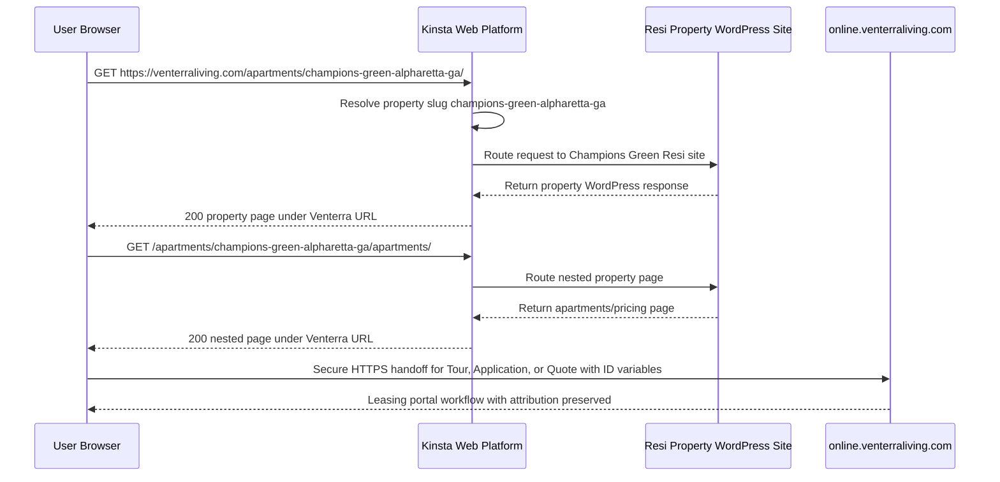

# Proposed Venterra Web Platform Architecture

Status: Proposed framework
Date: 05/26/2026
Audience: Internal technical review
Scope: Public Venterra web platform from SSL to Kinsta hosting, Resi property routing, and end-user experience

## 1. Executive Summary

Venterra's public web platform framework will be hosted on Kinsta.

Kinsta is the hosting layer for the public website, the Resi property websites, SSL delivery, WordPress runtime, and the direct reverse-proxy structure that preserves Venterra's public URL hierarchy.

The framework keeps `venterraliving.com` as the public domain, forces non-`www` canonical URLs, and serves property websites under a city/state-specific Venterra subdirectory structure:

```text
https://venterraliving.com/apartments/{property-slug}-{city}-{state}/
```

All canonical URLs use a trailing slash. The property sites are Resi WordPress websites hosted on Kinsta. The reverse-proxy model routes each property subdirectory to the appropriate Resi property site while keeping the user, search engines, analytics, and marketing campaigns on `venterraliving.com`.

Tours, applications, and quote workflows are intentionally handed off over HTTPS to Venterra's leasing portal at `online.venterraliving.com`. The handoff includes ID variables so the portal can preserve property, campaign, source, and session attribution.

## 2. Architecture Statement

Venterra will operate its public web platform on Kinsta. The platform uses `venterraliving.com` as the SSL-secured canonical domain and serves individual Resi property websites through preserved `/apartments/{property-slug}-{city}-{state}/` paths. Kinsta hosts the WordPress runtime and property site routing, while direct reverse-proxy routing keeps the browser-visible URL on `venterraliving.com` throughout the property journey.

## 3. Canonical URL Structure

The public URL structure is:

```text
https://venterraliving.com/apartments/{property-slug}-{city}-{state}/
```

Examples:

```text
https://venterraliving.com/apartments/champions-green-alpharetta-ga/
https://venterraliving.com/apartments/champions-green-alpharetta-ga/apartments/
https://venterraliving.com/apartments/champions-green-alpharetta-ga/amenities/
https://venterraliving.com/apartments/champions-green-alpharetta-ga/contact/
```

Canonical URL rules:

- Force HTTPS.
- Force non-`www`: `www.venterraliving.com` redirects to `venterraliving.com`.
- Include the property slug, city, and state in the property directory.
- Use lowercase hyphenated slugs.
- Use a trailing slash on canonical URLs.
- Keep property websites inside the Venterra domain instead of fragmenting users across separate property domains.

## 4. SSL Layer

The public SSL boundary is `venterraliving.com`.

SSL reference:

| Field | Value |
| --- | --- |
| Public domain | `venterraliving.com` |
| Certificate subject | `CN=venterraliving.com` |
| Certificate issuer | Let's Encrypt R13 |
| Valid from | 04/03/2026 14:02:22 UTC |
| Valid until | 07/02/2026 14:02:21 UTC |
| HTTPS behavior | HTTP redirects to HTTPS |
| Canonical host behavior | `www.venterraliving.com` redirects to `venterraliving.com` |
| HSTS | `max-age=31536000; includeSubDomains; preload` |

SSL responsibilities:

- Serve all public website traffic over HTTPS.
- Force all `www.venterraliving.com` requests to `venterraliving.com`.
- Keep `venterraliving.com` as the browser-visible host.
- Cover property subdirectory traffic under the primary domain certificate.
- Maintain secure HTTPS communication for property pages, assets, and user journeys.
- Avoid exposing implementation or origin hostnames as the public browsing destination.

## 5. Hosting Model

The proposed web platform is Kinsta-hosted.

| Layer | Responsibility |
| --- | --- |
| Kinsta hosting | Hosts the public WordPress web platform and Resi property WordPress sites |
| Kinsta SSL/web runtime | Serves HTTPS traffic for the public site experience |
| Kinsta reverse-proxy routing | Routes `/apartments/{property-slug}-{city}-{state}/` paths to the correct Resi property site |
| Resi WordPress property sites | Render property-specific marketing pages, content, media, metadata, and leasing CTAs |

## 6. Reverse Proxy Architecture

The direct Kinsta reverse proxy maps each Venterra property subdirectory to its corresponding Resi property website.

Conceptual route map:

| Public Venterra path | Kinsta-hosted Resi site |
| --- | --- |
| `/apartments/champions-green-alpharetta-ga/` | Champions Green Resi WordPress site |
| `/apartments/the-district-universal-boulevard-orlando-fl/` | The District Resi WordPress site |
| `/apartments/the-harrison-tampa-fl/` | The Harrison Resi WordPress site |
| `/apartments/ventana-corpus-christi-tx/` | Ventana Resi WordPress site |
| `/apartments/calais-midtown-houston-tx/` | Calais Midtown Resi WordPress site |

Request model:

```text
User browser
  -> https://venterraliving.com/apartments/champions-green-alpharetta-ga/
  -> Kinsta web platform
  -> Kinsta reverse-proxy route resolution
  -> Champions Green Resi WordPress site
  -> Response returned under venterraliving.com/apartments/champions-green-alpharetta-ga/
```

The user remains on `venterraliving.com` for the property website experience.

## 7. End-User Request Flow



## 8. Resi Property System

Each property website is a Resi WordPress site hosted on Kinsta.

The Resi property system provides:

- Property homepage.
- Apartments and pricing pages.
- Apartment-detail pages.
- Amenities pages.
- Gallery pages.
- Neighborhood pages.
- Contact pages.
- Specials pages.
- Reviews, FAQ, and about content.
- Property metadata and structured data.
- Property-specific imagery and media.
- Leasing calls to action.
- Secure handoff links for tours, applications, and quotes.

Known Resi components:

- WordPress CMS.
- Resi property theme layer.
- `resi-elements`.
- `resi-elements-venterra`.
- `resi-child-theme`.
- Resi DAM/media assets.
- Venterra prospect portal links for tours, applications, and quotes.

## 9. Path Preservation

Path preservation is the core technical requirement.

Internal property navigation must stay within the property's Venterra subdirectory.

| Property-site route | Public Venterra route |
| --- | --- |
| `/` | `/apartments/champions-green-alpharetta-ga/` |
| `/apartments/` | `/apartments/champions-green-alpharetta-ga/apartments/` |
| `/amenities/` | `/apartments/champions-green-alpharetta-ga/amenities/` |
| `/gallery/` | `/apartments/champions-green-alpharetta-ga/gallery/` |
| `/neighborhood/` | `/apartments/champions-green-alpharetta-ga/neighborhood/` |
| `/contact/` | `/apartments/champions-green-alpharetta-ga/contact/` |

External actions intentionally leave the property website when appropriate:

- Schedule tour.
- Apply now.
- Quote.
- Prospect portal.
- Resident portal.
- Social media.
- Google Maps.
- External media/CDN assets.

## 10. SEO and Canonical Behavior

The canonical public URL for each property page is the Venterra subdirectory URL.

Canonical target:

```text
https://venterraliving.com/apartments/{property-slug}-{city}-{state}/...
```

SEO requirements:

- Canonical tags use Venterra URLs.
- Canonical URLs use non-`www`.
- Canonical URLs include city and state in the property directory.
- Canonical URLs end with a trailing slash.
- Open Graph URLs use Venterra URLs.
- Structured-data page URLs use Venterra URLs.
- XML sitemaps list Venterra URLs.
- Internal links stay within the Venterra property subdirectory.
- Property pages consolidate domain authority under `venterraliving.com`.
- Implementation hostnames are not presented as public canonical destinations.

## 11. Headers and Request Context

Kinsta routing must preserve request context for WordPress, logs, analytics, debugging, and security.

Required request context:

- Public scheme: `https`.
- Public host: `venterraliving.com`.
- Public path: `/apartments/{property-slug}-{city}-{state}/...`.
- Client IP forwarding for logs and security controls.
- Original URI for routing and debugging.
- Property slug for route resolution.

## 12. Response Handling

Kinsta response handling keeps the browser inside the Venterra URL model.

Required behavior:

- Internal links resolve to Venterra subdirectory paths.
- Redirects remain within the Venterra subdirectory when they are part of property navigation.
- Query strings are preserved for filters, availability, specials, campaigns, and analytics.
- Intentional external links remain external.
- Metadata, canonical tags, and structured data align with the public Venterra URL.
- Public users are not sent to implementation hostnames during normal browsing.
- Tour, application, and quote links hand off intentionally and securely to `online.venterraliving.com`.
- Portal handoff links include ID variables needed to maintain attribution.

## 13. Secure Portal Handoff

Tours, applications, and quotes are not completed inside the public property website. They are handed off to Venterra's secure leasing portal:

```text
https://online.venterraliving.com/
```

Secure handoff behavior:

- Tour scheduling links send users to `online.venterraliving.com`.
- Application links send users to `online.venterraliving.com`.
- Quote links send users to `online.venterraliving.com`.
- The handoff uses HTTPS.
- The handoff is intentional external navigation from the marketing site to the leasing workflow.
- ID variables are passed during handoff so the portal receives the context required for attribution.
- Attribution context can include property identity, source, campaign, medium, content, keyword, click/session IDs, and other approved tracking IDs.
- The property website remains responsible for discovery, content, availability exploration, and calls to action.
- The portal remains responsible for transactional leasing workflows.

This separation keeps the public website focused on property marketing while routing sensitive leasing actions into the established Venterra portal environment.

## 14. Attribution Preservation

The website-to-portal handoff preserves attribution by passing approved ID variables into `online.venterraliving.com` when a user starts a tour, application, or quote workflow.

Attribution handoff responsibilities:

- Preserve property identity so the portal knows which property initiated the workflow.
- Preserve marketing attribution parameters when present.
- Preserve approved click/session identifiers when present.
- Preserve source and campaign context across the transition from the marketing site to the leasing portal.
- Avoid dropping attribution during reverse-proxy routing, redirects, or link normalization.

Common attribution variables may include:

```text
property_id
property_code
source
medium
campaign
content
term
gclid
gbraid
wbraid
msclkid
fbclid
session_id
```

The exact variable names should match the portal's accepted contract, but the architectural requirement is that tour, application, and quote CTAs carry the approved identifiers needed for downstream attribution.

## 15. Caching Strategy

Kinsta cache behavior should be property-aware and safe for public WordPress traffic.

Cacheable:

- Anonymous property homepage HTML.
- Anonymous content pages.
- Static theme assets.
- Static plugin assets.
- Public media and imagery.

Bypass cache:

- WordPress admin paths.
- Login/logout paths.
- Preview URLs.
- Authenticated sessions.
- Form submissions.
- Any dynamic availability or leasing state that cannot be safely cached.

Operational requirement:

- Property content updates should be purgeable at the property/page level.
- Cache purges should support targeted property updates without requiring full-site invalidation unless necessary.

## 16. Security Model

Security expectations:

- Public users browse over HTTPS only.
- `venterraliving.com` remains the public host.
- Property sites are served through Kinsta-controlled routing.
- WordPress admin/authenticated paths are not cached as public pages.
- Cookies are scoped intentionally.
- Redirects do not create loops or open redirects.
- Host and path handling cannot generate incorrect canonical URLs.
- Tours, applications, and quotes hand off only through HTTPS links to `online.venterraliving.com`.
- Attribution variables are passed only as approved handoff parameters for portal attribution.

Public controls:

- HTTPS.
- HSTS.
- Secure WordPress hosting.
- Safe cache bypass rules.
- Public/private path separation.

## 17. Analytics and Attribution

The preserved Venterra URL hierarchy gives analytics a clean and consistent path model.

Example page paths:

```text
/apartments/champions-green-alpharetta-ga/
/apartments/champions-green-alpharetta-ga/apartments/
/apartments/champions-green-alpharetta-ga/contact/
```

Analytics benefits:

- Property slug is available directly in the URL.
- Property traffic stays under the Venterra domain.
- Campaign URLs can use stable Venterra property paths.
- Tour, application, and quote portal exits are explicit conversion events.
- ID variables passed to the portal preserve attribution after the secure handoff.
- Cross-property reporting can use one consistent path taxonomy.

## 18. Operational Ownership

| Responsibility | Owner / system |
| --- | --- |
| Public domain | Venterra web operations |
| SSL | Kinsta-hosted web platform / Venterra web operations |
| Website hosting | Kinsta |
| Reverse-proxy routing | Kinsta web platform configuration |
| Property websites | Resi WordPress sites on Kinsta |
| Property content | Resi/property content operations |
| Media assets | Resi DAM/media infrastructure |
| Tours, applications, and quotes | `online.venterraliving.com` leasing portal |
| Attribution handoff contract | Venterra web/analytics operations + portal operations |
| SEO/canonical governance | Venterra web/SEO operations |

## 19. Route Map Governance

The route map defines which property slug routes to which Resi property site.

Each route should define:

- Public slug with city and state.
- Public Venterra path.
- Property display name.
- City and state.
- Property code.
- Kinsta-hosted Resi site target.
- Active/inactive status.
- Canonical URL.

Example:

```json
{
  "champions-green-alpharetta-ga": {
    "public_path": "/apartments/champions-green-alpharetta-ga/",
    "display_name": "Champions Green",
    "city": "Alpharetta",
    "state": "GA",
    "property_code": "GA4CG",
    "hosted_on": "Kinsta",
    "active": true,
    "canonical_url": "https://venterraliving.com/apartments/champions-green-alpharetta-ga/"
  }
}
```

## 20. Success Criteria

The architecture is working correctly when:

- Property pages load under `https://venterraliving.com/apartments/{property-slug}-{city}-{state}/`.
- Nested property pages remain under the same property subdirectory.
- `www` redirects to non-`www`.
- Canonical property URLs use a trailing slash.
- Internal navigation does not leave `venterraliving.com`.
- Property content remains managed in Resi WordPress on Kinsta.
- SSL and HTTPS work for the full user journey.
- SEO metadata uses Venterra canonical URLs.
- Tour, application, and quote CTAs securely hand off to `online.venterraliving.com`.
- Portal handoff links include the approved ID variables required to preserve attribution.
- Analytics can report property traffic using a consistent Venterra path hierarchy.

## 21. IT Review Appendix

This section summarizes the operational controls Andrew and IT leadership are likely to care about before approving the framework.

### 21.1 Ownership and Support Model

| Area | Primary owner | Notes |
| --- | --- | --- |
| Public web hosting | Kinsta / Venterra web operations | Kinsta hosts the public WordPress platform and Resi property sites |
| DNS | Venterra IT / web operations | Owns apex and `www` records, canonical host routing, and DNS change approvals |
| SSL certificates | Kinsta-managed hosting configuration / Venterra web operations | Kinsta provisions and auto-renews SSL certificates; Venterra web operations monitors certificate health, expiration, and hostname coverage |
| Reverse-proxy routing | Kinsta web platform configuration / Venterra web operations | Owns property slug to Resi site mapping |
| Resi WordPress sites | Resi/property content operations | Owns property pages, templates, content, and media references |
| Portal workflows | Venterra portal operations | Owns tours, applications, and quote workflows at `online.venterraliving.com` |
| Attribution contract | Web analytics + portal operations | Owns approved ID variables and validation |
| SEO/canonical policy | Web/SEO operations | Owns non-`www`, trailing slash, city/state slugs, canonicals, and sitemap rules |
| Incident response | Venterra IT + web operations + Kinsta support | Owns outage triage, escalation, rollback, and communications |

### 21.2 DNS Plan

Canonical host behavior:

- `venterraliving.com` is the canonical public host.
- `www.venterraliving.com` redirects to `venterraliving.com`.
- Property pages are served as subdirectories under `venterraliving.com`.
- Property canonical URLs include property slug, city, state, and trailing slash.

DNS responsibilities:

- Maintain apex domain records required by Kinsta.
- Maintain `www` records required for redirect handling.
- Avoid DNS configurations that send users to non-canonical property domains during normal browsing.
- Coordinate TTL changes before major launches or cutovers.
- Keep a change log for DNS edits.

Validation checks:

```bash
dig venterraliving.com
dig www.venterraliving.com
curl -sSI https://venterraliving.com/
curl -sSI https://www.venterraliving.com/
```

Expected result:

- Apex resolves to the approved Kinsta-hosted web platform.
- `www` resolves or redirects according to the approved Kinsta configuration.
- `www` requests end at the non-`www` canonical URL.

### 21.3 SSL Lifecycle and Maintenance

SSL is a managed operational control for the public web platform.

SSL responsibilities:

- Maintain a valid certificate for `venterraliving.com`.
- Maintain a valid certificate or redirect coverage for `www.venterraliving.com`.
- Ensure all property subdirectory pages are served over HTTPS.
- Ensure portal handoffs use HTTPS to `online.venterraliving.com`.
- Renew certificates before expiration.
- Alert before expiration or validation failure.

Certificate renewal model:

- Certificates are managed by Kinsta.
- Renewal is automatic through Kinsta-managed SSL.
- Renewal must be validated by external monitoring.
- Certificate validation must cover both apex and `www` behavior.
- Any failed renewal should be treated as a production incident because browsers will block or warn users.

Minimum SSL monitoring:

- Daily HTTPS availability check.
- Daily certificate expiration check.
- Alert at 30, 14, and 7 days before certificate expiration.
- Alert immediately if certificate validation fails.
- Alert immediately if HTTP no longer redirects to HTTPS.
- Alert immediately if `www` no longer redirects to non-`www`.

SSL validation commands:

```bash
openssl s_client -servername venterraliving.com -connect venterraliving.com:443 </dev/null 2>/dev/null \
  | openssl x509 -noout -subject -issuer -dates -serial -fingerprint -sha256

curl -sSI https://venterraliving.com/
curl -sSI http://venterraliving.com/
curl -sSI https://www.venterraliving.com/
```

Expected SSL behavior:

- Certificate is valid and trusted.
- Certificate is not near expiration.
- HTTPS returns a successful response.
- HTTP redirects to HTTPS.
- `www` redirects to non-`www`.
- HSTS is present once the final HTTPS posture is confirmed.

HSTS policy:

- HSTS tells browsers to use HTTPS only.
- HSTS should remain enabled only when all affected hostnames are HTTPS-ready.
- `includeSubDomains` should be used only when every covered subdomain is prepared for HTTPS enforcement.
- HSTS preload should be treated as a high-confidence commitment because removal is not immediate across browsers.

SSL failure response:

1. Confirm whether the failure affects apex, `www`, or both.
2. Confirm certificate expiration, issuer, and hostname coverage.
3. Check Kinsta SSL status and renewal state.
4. Escalate to Kinsta support if renewal or certificate provisioning failed.
5. Pause launch/cutover if SSL cannot be verified.
6. Re-test after remediation from an external network.

### 21.4 Reverse-Proxy Route Map Governance

The route map is a production control.

Each property route should define:

- Public slug with property, city, and state.
- Canonical public path.
- Property display name.
- Property code.
- Kinsta-hosted Resi site target.
- Active/inactive state.
- Launch date.
- Redirect behavior for old or alternate URLs.
- Owner/approver for changes.

Route-map change requirements:

- New route is reviewed before launch.
- Property slug follows the approved format.
- City and state are included.
- Trailing slash behavior is tested.
- Internal links remain inside the property subdirectory.
- Portal CTAs work and preserve attribution.
- Canonical tags and structured data use the final Venterra URL.
- Rollback path is documented.

### 21.5 Security Controls

Required controls:

- HTTPS-only public traffic.
- Non-`www` canonical enforcement.
- HSTS after final HTTPS readiness is confirmed.
- WordPress admin paths protected from public cache behavior.
- Login, preview, and authenticated requests bypass cache.
- Host and path handling cannot create incorrect canonical URLs.
- Redirect behavior cannot create loops or open redirects.
- Portal handoff uses HTTPS only.
- Attribution variables are approved and limited to tracking/identity context needed by the portal.

Admin and dynamic path handling:

- WordPress admin paths should never be cached as public HTML.
- Preview URLs should bypass cache.
- Authenticated sessions should bypass cache.
- Form submissions should bypass cache.
- Portal workflows should remain on `online.venterraliving.com`.

### 21.6 Cache and Purge Model

Cacheable:

- Anonymous property homepage HTML.
- Anonymous property content pages.
- Static WordPress theme assets.
- Static plugin assets.
- Public media assets.

Bypass:

- WordPress admin.
- WordPress login/logout.
- Preview URLs.
- Authenticated sessions.
- Form submissions.
- Dynamic leasing or availability state when freshness cannot be guaranteed.
- Portal workflows.

Purge expectations:

- Property page updates can be purged at the property/page level.
- Global purges should be reserved for broad template or platform changes.
- Purge should include affected HTML and dependent assets when necessary.
- Post-purge validation should confirm the updated content appears at the canonical Venterra URL.

### 21.7 Portal Handoff Contract

Tours, applications, and quotes hand off to:

```text
https://online.venterraliving.com/
```

The portal handoff must preserve approved attribution variables.

The handoff contract should define:

- Required property identifier.
- Required property code.
- Accepted source/campaign parameters.
- Accepted click/session identifiers.
- Required URL encoding rules.
- Which parameters are allowed.
- Which parameters are forbidden.
- How missing or invalid parameters are handled.
- Who owns changes to the parameter contract.

Validation requirements:

- Tour links arrive at the correct property workflow.
- Application links arrive at the correct property workflow.
- Quote links arrive at the correct property workflow.
- Approved ID variables are present at handoff.
- Attribution is visible in downstream portal/reporting systems.
- Invalid or missing optional parameters do not break the user journey.

### 21.8 Monitoring and Alerting

Minimum monitoring:

- Public homepage availability.
- Representative property page availability.
- Nested property page availability.
- HTTP to HTTPS redirect.
- `www` to non-`www` redirect.
- Certificate expiration.
- HSTS/header presence.
- Portal handoff availability.
- Portal handoff attribution parameter preservation.
- 404 rate on property routes.
- Redirect loop detection.
- Cache freshness after content updates.

Representative synthetic checks:

```text
GET https://venterraliving.com/
GET https://venterraliving.com/apartments/champions-green-alpharetta-ga/
GET https://venterraliving.com/apartments/champions-green-alpharetta-ga/apartments/
HEAD https://www.venterraliving.com/
HEAD http://venterraliving.com/
GET tour CTA target
GET application CTA target
GET quote CTA target
```

Alerting should notify web operations and IT for:

- SSL failure.
- Certificate expiration risk.
- Homepage outage.
- Property route outage.
- Unexpected redirect to an implementation hostname.
- Redirect loop.
- Spike in 404s.
- Portal handoff failure.
- Missing required attribution IDs.

### 21.9 Failure Modes and Rollback

Key failure modes:

- SSL certificate expires or fails validation.
- `www` canonical redirect fails.
- Property route returns 404 or 500.
- Reverse-proxy mapping sends a property slug to the wrong site.
- Internal links leave the Venterra URL structure.
- Canonical metadata exposes the wrong hostname.
- Portal handoff fails.
- Attribution IDs are dropped.
- Cache serves stale or incorrect property content.

Rollback actions:

- Disable or revert the affected property route.
- Restore the previous known-good route map.
- Purge affected Kinsta cache.
- Revert recent WordPress/template changes if they caused broken links or metadata.
- Escalate SSL/certificate issues through Kinsta support.
- Escalate portal handoff issues through portal operations.
- Pause launch of additional property routes until the failed control is corrected.

### 21.10 Change Management

Required before launch or route changes:

- DNS check.
- SSL check.
- Route-map review.
- Property page smoke test.
- Nested page smoke test.
- Canonical tag check.
- Structured-data URL check.
- Portal handoff check.
- Attribution parameter check.
- Cache bypass check for admin/preview paths.
- Rollback plan confirmation.

Approval should include:

- Web operations.
- SEO owner.
- Portal owner for tour/application/quote handoff.
- Analytics owner for attribution variables.
- IT owner for DNS/SSL/security review.

### 21.11 Privacy and Data Boundary

The public marketing site should not process sensitive application data.

Data boundary:

- Public property pages support discovery and calls to action.
- Tours, applications, and quotes hand off to `online.venterraliving.com`.
- Attribution IDs passed during handoff are limited to approved tracking and property context.
- Sensitive leasing/application workflows remain in the portal environment.
- The website should not collect or store applicant-sensitive data outside approved forms and systems.
