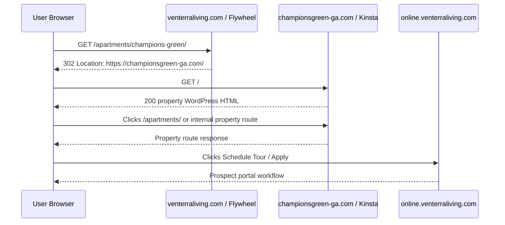
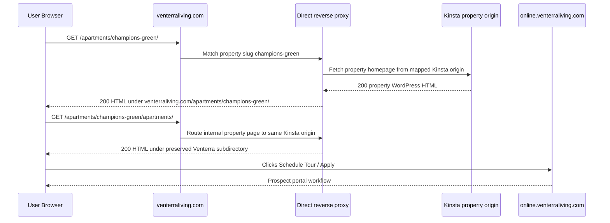

# Web Platform Internal Technical Documentation

Status: Internal baseline
Date: 05/26/2026
Scope: Venterra public web platform only, from SSL to host to Resi property experience to end user

## 1. Purpose

Document the current public web platform stack for Venterra's marketing website and Resi property-site experience.

This document is limited to the web platform that serves public website users. It excludes Data Pond, Cloudflare Workers, D1, R2, internal agent systems, reporting apps, and analytics dashboards. Cloudflare is outside the scope of this document except where a third-party response header is visible on a Resi/Kinsta-hosted property site; it is not treated here as a Venterra platform dependency or control plane.

## 2. Current Platform Summary

The public web platform has two major website layers today:

1. `venterraliving.com`
   - Primary Venterra marketing domain.
   - Hosted on Flywheel/Fastly based on observed response headers.
   - Serves the corporate/public WordPress site.
   - Provides SSL termination, canonical public domain, and current `/apartments/...` entry paths.

2. Resi property sites
   - Individual property marketing websites.
   - Hosted on Kinsta-backed WordPress infrastructure.
   - Built with Resi WordPress components, including `resi-elements`, `resi-elements-venterra`, and `resi-child-theme`.
   - Use property-level routes such as `/`, `/apartments/`, property content sections, DAM images, and prospect CTAs.

The active web-platform direction is a direct-to-Kinsta reverse-proxy solution. The purpose of that model is to keep users on the Venterra URL structure, such as:

```text
https://venterraliving.com/apartments/{property-slug}/
```

while routing the property-site request to the correct individual Kinsta-hosted Resi property server behind the scenes.

Important current-state note:

- In the live check performed on 05/26/2026, `https://venterraliving.com/apartments/champions-green/` returned a `302` redirect to `https://championsgreen-ga.com/`.
- That means the sample property path is currently redirecting to the property vanity domain, not yet transparently reverse-proxying the Kinsta property site under the Venterra subdirectory.
- This document therefore distinguishes current observed behavior from the direct-to-Kinsta reverse-proxy operating model.

## 3. What Exists Today

| Area | Current state |
| --- | --- |
| Primary public domain | `venterraliving.com` |
| Primary public host | Flywheel/Fastly, based on `server: Flywheel/5.1.0`, `x-fw-*`, and Fastly cache headers |
| Primary site CMS | WordPress |
| Primary SSL issuer | Let's Encrypt R13 |
| Primary HSTS | Present: `max-age=31536000; includeSubDomains; preload` |
| Sample property path | `https://venterraliving.com/apartments/champions-green/` |
| Sample property-path behavior | `302` redirect to `https://championsgreen-ga.com/` via Rank Math |
| Sample Resi property site | `https://championsgreen-ga.com/` |
| Sample property host | Kinsta-backed WordPress, based on `ki-origin`, `ki-edge`, and `x-kinsta-cache` headers |
| Pilot/test Resi host | `https://pilot.venterradev.com/` |
| Pilot/test Resi site identity | Apex West Midtown |
| Resi WordPress components | `resi-elements`, `resi-elements-venterra`, `resi-child-theme` |
| Resi DAM/media | `dam.getresi.co`, `media.getresi.co` |
| Prospect portal CTAs | `online.venterraliving.com/eOnlineLease/...` |
| Source-controlled reverse-proxy config | Not found in this repository during this review |

## 4. SSL Layer

### 4.1 Primary Domain: `venterraliving.com`

Observed certificate:

| Field | Value |
| --- | --- |
| Subject | `CN=venterraliving.com` |
| Issuer | `C=US, O=Let's Encrypt, CN=R13` |
| Valid from | 04/03/2026 14:02:22 UTC |
| Valid until | 07/02/2026 14:02:21 UTC |
| Serial | `0610DE6583F41FED2B6F2EBF012191AD5AC6` |
| SHA-256 fingerprint | `B6:3B:0A:8C:CF:F0:32:A4:0B:24:7D:A8:34:B0:4B:6F:18:47:A9:C0:5B:27:EA:81:04:53:9B:62:1E:7A:2C:E7` |

Observed HTTPS behavior:

- `https://venterraliving.com/` returns `200`.
- `http://venterraliving.com/` redirects to HTTPS.
- `https://www.venterraliving.com/` redirects to `https://venterraliving.com/`.
- HSTS is enabled with `includeSubDomains` and `preload`.

Operational meaning:

- Browsers should only use HTTPS after first contact or HSTS preload.
- Because HSTS includes subdomains, all active subdomains under `venterraliving.com` must remain HTTPS-capable.
- Any reverse-proxy implementation under `venterraliving.com/apartments/...` inherits the primary domain's SSL and HSTS expectations.

### 4.2 Sample Resi Property Domain: `championsgreen-ga.com`

Observed certificate:

| Field | Value |
| --- | --- |
| Subject | `CN=championsgreen-ga.com` |
| Issuer | `C=US, O=Google Trust Services, CN=WE1` |
| Valid from | 05/19/2026 03:46:26 UTC |
| Valid until | 08/17/2026 04:46:14 UTC |
| Serial | `4E58106AD025CC860E0C48FC51BF158F` |
| SHA-256 fingerprint | `8D:F7:54:F8:16:AC:A8:C8:C0:2A:D7:83:DD:1B:FB:62:84:BB:CE:B8:2C:20:58:3E:E3:E5:1C:A0:1B:62:33:FD` |

Observed HTTPS behavior:

- `https://championsgreen-ga.com/` returns `200`.
- The response is WordPress HTML with Kinsta markers.
- The page advertises WordPress REST metadata through `wp-json`.

### 4.3 Pilot Resi Host: `pilot.venterradev.com`

Observed certificate:

| Field | Value |
| --- | --- |
| Subject | `CN=pilot.venterradev.com` |
| Issuer | `C=US, O=Let's Encrypt, CN=E7` |
| Valid from | 04/30/2026 13:33:40 UTC |
| Valid until | 07/29/2026 13:33:39 UTC |
| Serial | `06F7BA8FFF283C96799FE20F2E55D1FE57C7` |
| SHA-256 fingerprint | `38:51:BD:AD:9E:E5:09:89:81:B3:D7:77:83:7E:AE:95:E5:EB:D0:21:66:CF:4C:A1:5E:B9:5A:A5:F7:7A:63:AA` |

Observed site identity:

- The page identifies as Apex West Midtown.
- It is a Resi property-site implementation using the same general component family as the property vanity sites.

## 5. Host Layer

### 5.1 Primary Host

`venterraliving.com` is currently served by Flywheel/Fastly.

Observed headers:

```text
server: Flywheel/5.1.0
x-fw-server: Flywheel/5.1.0
x-fw-version: 5.0.0
x-fw-hash: qf6w2t3yu1
x-served-by: cache-dfw-...
x-cache: MISS, HIT
```

Observed DNS:

```text
venterraliving.com       A 151.101.2.159
www.venterraliving.com   A 151.101.66.159
```

Primary host responsibilities:

- Terminate public SSL for `venterraliving.com`.
- Serve the main WordPress site.
- Own canonical public URL structure.
- Redirect HTTP to HTTPS.
- Redirect `www` to apex.
- Serve or route `/apartments/...` paths.

### 5.2 Resi/Kinsta Property Host

Individual property sites are Kinsta-backed WordPress sites.

Observed Kinsta markers:

```text
ki-origin: g1p
ki-edge: v=27.1.2;mv=99.9.9
x-kinsta-cache: HIT | MISS | BYPASS
```

Kinsta property-site responsibilities:

- Serve the property-specific WordPress application.
- Render property marketing content.
- Serve property navigation and internal routes, including `/apartments/`.
- Expose WordPress REST metadata at `/wp-json/`.
- Serve Resi theme/plugin assets.
- Reference external DAM/media and prospect portal destinations.

## 6. Direct-to-Kinsta Reverse-Proxy Model

The current web-platform approach is to use a direct reverse proxy from the Venterra URL structure to individual Kinsta property servers.

Goal:

- Preserve `venterraliving.com` as the user-visible domain.
- Preserve the `/apartments/{property-slug}/` subdirectory structure.
- Route each property slug to the correct Kinsta property server.
- Avoid sending the user to a separate vanity domain when a subdirectory page should remain under `venterraliving.com`.

Current observed gap:

- The sample path `https://venterraliving.com/apartments/champions-green/` still redirects to `https://championsgreen-ga.com/`.
- The reverse proxy behavior is therefore not yet observable for this sample route.

Expected reverse-proxy request model:

```text
User browser
  -> https://venterraliving.com/apartments/champions-green/
  -> Primary Venterra web host / reverse-proxy layer
  -> Kinsta property origin for Champions Green
  -> Response rewritten/preserved under /apartments/champions-green/
  -> User remains on venterraliving.com
```

Minimum reverse-proxy requirements:

- Match the property slug from `/apartments/{property-slug}/`.
- Map the slug to the correct Kinsta property origin.
- Preserve the original external host as `venterraliving.com`.
- Preserve or set `X-Forwarded-Host`, `X-Forwarded-Proto`, and related forwarding headers as required by Kinsta/WordPress.
- Avoid leaking origin-only Kinsta URLs in canonical links, schema, assets, redirects, sitemaps, forms, or internal navigation.
- Rewrite absolute property-domain links where needed so internal property navigation stays under `/apartments/{property-slug}/`.
- Allow external links to remain external when they intentionally leave the website, such as prospect portal, social, maps, and media URLs.
- Preserve query strings for search, availability filters, specials, tracking, and campaign attribution.
- Preserve status codes correctly.
- Do not cache logged-in/admin/preview/session traffic as public HTML.

## 7. URL Structure

### 7.1 Current Primary URL Pattern

Observed entry pattern:

```text
https://venterraliving.com/apartments/champions-green/
```

Observed live behavior:

```text
302 Location: https://championsgreen-ga.com/
x-redirect-by: Rank Math
```

### 7.2 Desired Direct-to-Kinsta URL Pattern

The user-facing URL should remain:

```text
https://venterraliving.com/apartments/{property-slug}/
```

Examples:

```text
https://venterraliving.com/apartments/champions-green/
https://venterraliving.com/apartments/champions-green/apartments/
https://venterraliving.com/apartments/champions-green/contact/
https://venterraliving.com/apartments/champions-green/amenities/
```

The property origin can be a Kinsta site or property vanity domain, but the browser should not need to change hostnames for normal property-site navigation.

## 8. Resi Property System

The Resi property sites are WordPress property-marketing sites.

Observed components:

- WordPress.
- YOOtheme-style page output/classes.
- `resi-elements` plugin assets.
- `resi-elements-venterra` plugin assets.
- `resi-child-theme`.
- Property page metadata through `data-*` body attributes.
- JSON-LD structured data for `LocalBusiness`, `ApartmentComplex`, `Organization`, and `WebSite`.
- DAM/media assets from `dam.getresi.co`.
- Video assets from `media.getresi.co`.
- Prospect CTAs to `online.venterraliving.com/eOnlineLease/...`.

Sample property body metadata observed on Champions Green:

```text
data-property-name="Champions Green"
data-property-code="GA4CG"
data-site-archetype="property_marketing_v1"
data-page-template="homepage"
```

Sample pilot body metadata observed on Apex West Midtown:

```text
data-property-name="Apex West Midtown"
data-property-code="TX054"
data-site-archetype="property_marketing_v1"
data-page-template="homepage"
```

## 9. Resi Page Dependencies

Current external or cross-host dependencies visible in page output:

| Dependency | Purpose |
| --- | --- |
| `dam.getresi.co` | Image and SVG asset delivery |
| `media.getresi.co` | Video asset delivery |
| `js.getresi.co` | DNS-prefetched script host |
| `online.venterraliving.com` | Prospect portal actions such as schedule tour and apply now |
| WordPress REST `/wp-json/` | WordPress metadata and API discovery |
| Property social/map links | External user navigation |

Reverse-proxy implication:

- Static/media/DAM links can remain external when intended.
- Prospect portal URLs should remain external because they initiate leasing workflows.
- Internal property links such as `/apartments/` must be evaluated carefully. Behind a subdirectory proxy, a root-relative property link can accidentally resolve to `https://venterraliving.com/apartments/` instead of `https://venterraliving.com/apartments/{property-slug}/apartments/` unless link rewriting or WordPress base URL configuration handles it.

## 10. User Request Flow

### 10.1 Current Observed Flow for Sample Property



### 10.2 Direct-to-Kinsta Reverse-Proxy Flow



## 11. SEO and Canonical Requirements

The reverse-proxy model affects SEO because property pages become subdirectory pages under `venterraliving.com`.

Required controls:

- Canonical tags should point to the final Venterra subdirectory URL, not the Kinsta origin or property vanity domain, when the subdirectory is the intended canonical surface.
- XML sitemaps should list the final Venterra subdirectory URLs.
- Internal links should not push users back to origin domains.
- JSON-LD `url` fields should be reviewed so they do not expose `*.kinsta.cloud` as canonical public URLs.
- `og:url` and social metadata should align with the public Venterra URL.
- Redirect chains should be minimized.
- Property vanity domains should have a deliberate canonical policy: either redirect to Venterra subdirectories or remain separate only where explicitly intended.

Current observed issue to resolve before declaring subdirectory proxy complete:

- Champions Green JSON-LD includes origin-style URLs such as `https://championsgreen.kinsta.cloud/` in structured data.
- A reverse-proxy rollout should correct or rewrite those values for the public canonical URL model.

## 12. Caching Requirements

The web platform has two separate caching concerns:

1. Primary site cache
   - Flywheel/Fastly currently handles `venterraliving.com` responses.
   - `x-cache` and `x-fw-*` headers show cache behavior.

2. Kinsta property-site cache
   - Kinsta headers show property-origin cache behavior.
   - `x-kinsta-cache` can be `HIT`, `MISS`, or `BYPASS`.

Reverse-proxy caching requirements:

- Cache anonymous property HTML only when safe.
- Bypass cache for WordPress admin, login, previews, search/admin query parameters, and session-bearing requests.
- Purge both the primary host/proxy cache and the Kinsta property cache after content deployments.
- Preserve no-cache behavior for dynamic availability, specials, forms, and prospect workflows if those are rendered dynamically.
- Avoid caching redirected states while proxy rollout is being validated.

## 13. Security Requirements

Current observed controls:

- HTTPS on `venterraliving.com`.
- HSTS on `venterraliving.com`.
- `x-content-type-options: nosniff` on primary and sample property responses.
- `referrer-policy: no-referrer-when-downgrade` on `venterraliving.com`.

Required controls for direct-to-Kinsta proxy:

- Keep all public traffic HTTPS-only.
- Do not expose WordPress admin paths unintentionally through the public subdirectory proxy.
- Do not proxy authenticated admin sessions through shared public cache.
- Preserve secure cookies correctly.
- Ensure origin and public host redirects cannot create loops.
- Ensure host header handling cannot be abused to generate arbitrary canonical links or redirects.
- Add a clear policy for WordPress REST exposure under proxied paths.

## 14. Operational Ownership

| Layer | Operational owner / control point |
| --- | --- |
| `venterraliving.com` DNS and SSL | Public web/hosting operations |
| Primary WordPress site | Flywheel-hosted Venterra web CMS |
| Resi property WordPress sites | Kinsta-hosted property site operations |
| Reverse-proxy routing map | Web hosting/reverse-proxy operations |
| Property content and metadata | Resi/property content operations |
| DAM/media | Resi media/DAM operations |
| Prospect portal links | Leasing/prospect portal operations |
| SEO/canonical policy | Web/SEO operations |

## 15. Current Validation Commands

Primary domain headers:

```bash
curl -sSI https://venterraliving.com/
```

Sample property path behavior:

```bash
curl -sSI https://venterraliving.com/apartments/champions-green/
```

Sample Kinsta property response:

```bash
curl -sSI https://championsgreen-ga.com/
```

Certificate inventory:

```bash
openssl s_client -servername venterraliving.com -connect venterraliving.com:443 </dev/null 2>/dev/null \
  | openssl x509 -noout -subject -issuer -dates -serial -fingerprint -sha256
```

Resi component check:

```bash
curl -sS https://championsgreen-ga.com/ \
  | rg -i "resi-elements|resi-child-theme|dam.getresi.co|online.venterraliving.com|data-property-code"
```

## 16. Known Current Gaps

| Gap | Evidence | Required resolution |
| --- | --- | --- |
| Subdirectory proxy not observable on sample route | `/apartments/champions-green/` returns `302` to `championsgreen-ga.com` | Replace redirect behavior with direct-to-Kinsta proxy behavior for property routes |
| No source-controlled reverse-proxy config found | Repository search did not find an Nginx/Kinsta/proxy routing config | Store or document the route map and proxy rules in an approved internal ops location |
| Property structured data exposes Kinsta origin URLs | Sample page JSON-LD includes `https://championsgreen.kinsta.cloud/` | Update WordPress/site configuration or proxy rewriting so public canonical data matches final URL model |
| Root-relative property links need subdirectory handling | Resi pages use links such as `/apartments/` | Ensure proxy/base URL rewriting resolves links under `/apartments/{property-slug}/` |
| Current redirects fragment user-visible domain experience | Sample path leaves `venterraliving.com` | Use reverse proxy to preserve Venterra host and subdirectory structure |

## 17. Source References

Observed live endpoints:

- `https://venterraliving.com/`
- `https://venterraliving.com/apartments/champions-green/`
- `https://championsgreen-ga.com/`
- `https://pilot.venterradev.com/`

Repository references:

- `pilot_control_cwv/config/pilot_control_cwv_config.example.json`
- `docs/SSL_TECHNICAL_DOCUMENTATION_2026-05-26.md`
